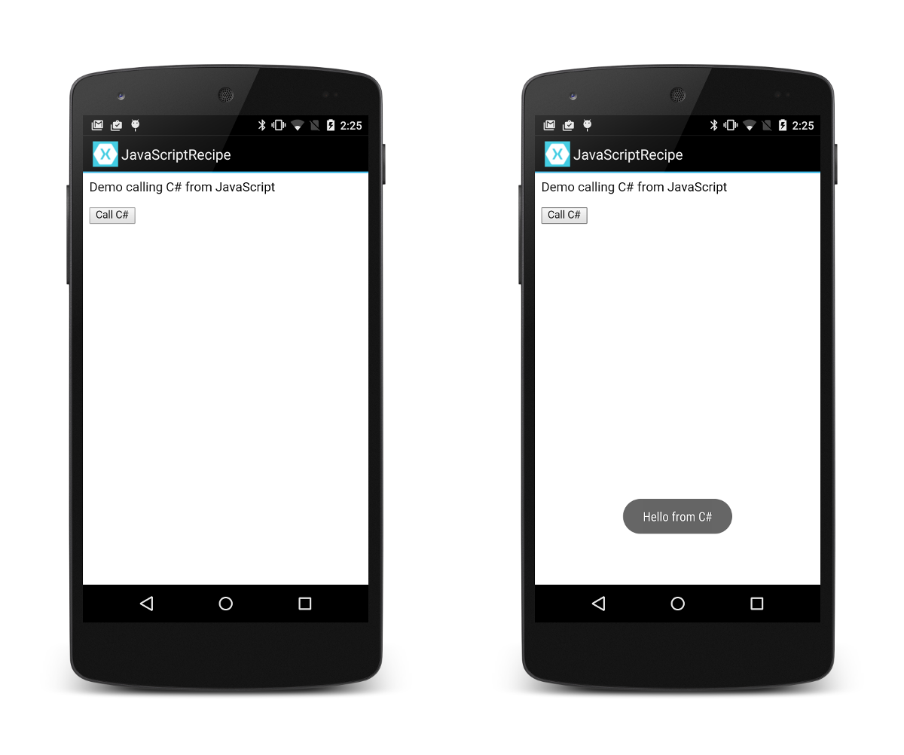

# Recipe

A screenshot of the demo app created by this recipe is shown below:

[ ](Images/screenshots.png)


<a name="annotate"></a>

## Create a JavaScript Interface Class

Create a C# class that contains methods to be called from JavaScript.
If you are targeting Android API level 17 or later, this
JavaScript-to-C# interface class must annotate each JavaScript-callable
method with `[JavascriptInterface]` and `[Export]` as shown in the
following example. If you are targeting Android API Level 16 or
earlier, this interface class must implement `Java.Lang.IRunnable` as
explained in [Android API Level 16 and Earlier](#userunnable) (later in this
recipe):


-   Create a C# class that is derived from `Java.Lang.Object`.
    In the following example, we name our class `MyJSInterface` and
    implement a method to display a toast when it is called from
    JavaScript:

```
class MyJSInterface : Java.Lang.Object
{
    Context context;

    public MyJSInterface (Context context)
    {
        this.context = context;
    }

    public void ShowToast ()
    {
        Toast.MakeText(context, "Hello from C#", ToastLength.Short).Show();
    }
}
```

-   Annotate each method that is to be exposed to JavaScript with
    `[Export]` and `[JavascriptInterface]` (see
    [IJavascriptInterface](https://developer.xamarin.com/api/type/Android.Webkit.IJavascriptInterface/)
    for more information about the `JavascriptInterface` annotation).
    In the following example, the `ShowToast` method is annotated so
    that it can be called from JavaScript. Note that you must include the
    `Java.Interop` and `Android.Webkit` using statements as shown in this example:

```
using Java.Interop;
using Android.Webkit;
...
[Export]
[JavascriptInterface]
public void ShowToast ()
{
    Toast.MakeText(context, "Hello from C#", ToastLength.Short).Show();
}
```

-   Add a project reference to **Mono.Android.Export** (so you can
    use the `[Export]` annotation):

    1.  In Visual Studio, right-click **References** in the Solution Explorer and
        select **Add Reference...**. In Visual Studio for Mac, right-click **References** in
        the Solution Pad and select **Edit References...**.

    2.  In the search field, enter `Mono.Android.Export`. When you have located it,
        enable the check mark next to it and click **OK**.


<a name="invoke"></a>

##  Call Methods in Your Interface Class from JavaScript

Next, invoke the `ShowToast` method from a JavaScript `onClick`
event in an HTML document. Before we can do this, we must add our
interface class to the `WebView` that displays this HTML content.

-   In the Activity `OnCreate` method, create a `WebView` instance and
    add it as the content view. Add the `MyJSInterface` class to this
    `WebView` instance as follows:

    1.  Set the `WebView`'s `JavaScriptEnabled` flag to `true`.

    2.  Use [AddJavascriptInterface](https://developer.xamarin.com/api/member/Android.Webkit.WebView.AddJavascriptInterface) to add an instance of `MyJSInterface` to the `WebView` as its JavaScript interface.

    3.  Load the HTML content into the `WebView`.

    The following `OnCreate` example accomplishes these steps, passing
    in a simple HTML document to the `WebView`. Note that the call
    to `AddJavaScriptInterface` associates the JavaScript name "**CSharp**"
    with an instance of the `MyJSInterface` class (here it is called
    "**CSharp**", but you can use any name you like):

```
using Android.Webkit;
...
const string html = @"
<html>
  <body>
    <p>Demo calling C# from JavaScript</p>
  </body>
</html>";
...
protected override void OnCreate(Bundle bundle)
{
    base.OnCreate(bundle);

    WebView webView = new WebView(this);
    SetContentView(webView);

    webView.Settings.JavaScriptEnabled = true;
    webView.AddJavascriptInterface(new MyJSInterface(this), "CSharp");
    webView.LoadData(html, "text/html", null);
}

```

-   Call the C# `ShowToast` method from the HTML document. Add a button to
    the HTML document that invokes the JavaScript fragment `Csharp.ShowToast()` as
    shown in this example:

```
const string html = @"
<html>
  <body>
    <p>Demo calling C# from JavaScript</p>
    <button type=""button"" onClick=""CSharp.ShowToast()"">Call C#</button>
  </body>
</html>";
```

-   Build and run the app. The `WebView` presents the HTML document
    with the "**Call C#**" button (see the screenshot above on the left). When
    you press this button, the `ShowToast` method is invoked,  displaying the
    "**Hello from C#**" toast as seen in the screenshot above on the right.


<a name="userunnable"></a>

## Android API Level 16 and Earlier

In versions of Android at API Level 16 or earlier, your
JavaScript-to-C# interface class must implement `Java.Lang.IRunnable`
as shown in the following example.

-   Create a C# class that is derived from `Java.Lang.Object` and
    `Java.Lang.IRunnable`; this class implements a `Run` method that
    can be called from JavaScript. In the following example, we name
    our class `MyJSInterface`:

```
class MyJSInterface : Java.Lang.Object, Java.Lang.IRunnable
{
    Context context;

    public MyJSInterface (Context context)
    {
        this.context = context;
    }

    public void Run ()
    {
        Toast.MakeText(context, "Hello from C#", ToastLength.Short).Show();
    }
}
```

-   As explained [earlier](#invoke), add code to the `OnCreate` method
    to create a `WebView` instance, adding the `MyJSInterface` JavaScript
    interface class to this instance. However, to invoke our 
    C# method from JavaScript, we must call the `run` method as shown in
    this example:

```
const string html = @"
<html>
  <body>
    <p>Demo calling C# from JavaScript</p>
    <button type=""button"" onClick=""CSharp.run()"">Call C#</button>
  </body>
</html>";
```

Xamarin.Android creates an *Android Callable Wrapper (ACW)* for the
`MyJSInterface` class because it derives from `Java.Lang.Object`.
Calling `AddJavascriptInterface` connects the `MyJSInterface`
JavaScript variable with the ACW. In this last example, the ACW has the
name `run` (lowercase 'r') for its `java.lang.Runnable` implementation.
This is why the JavaScript code calls `run()`. In turn, the ACW is
bound to the C# class with the `Run` method (uppercase 'R').

# Additional Information

Jon Pryor's
[StackOverflow post](http://stackoverflow.com/questions/9745168/monodroid-javascript-call-back/9746911)
provides more detailed information about how Xamarin.Android (referred
to as *Mono for Android* in the post) uses Android Callable Wrappers to
make "JavaScript-within-Android" functionality possible.

