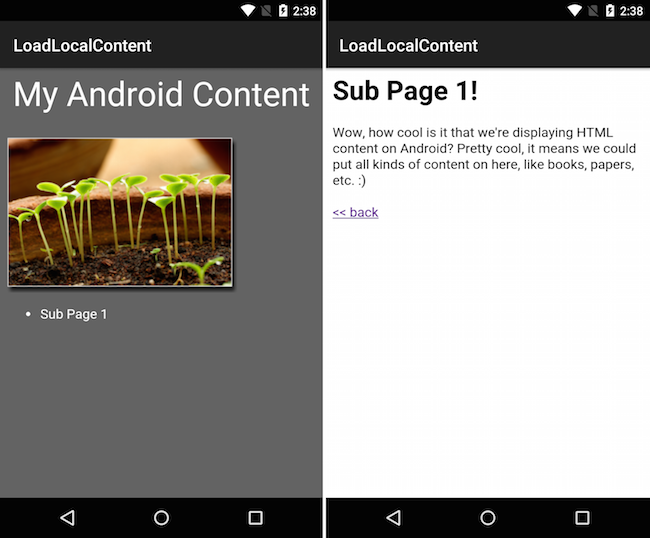

<a name="Recipe" class="injected"></a>


# Recipe

-  Create a layout file that contains a WebView, such as Main.axml in the example code:


```
<?xml version="1.0" encoding="utf-8"?>
<WebView xmlns:android="http://schemas.android.com/apk/res/android"
 android:layout_width="fill_parent"
 android:layout_height="fill_parent"
 android:id="@+id/LocalWebView">
</WebView>
```

-  Add the Html content (including images and stylesheets) to the Assets folder (the Build Action should automatically be set to AndroidAsset). In the example code there are two Html files (Home.html and SubPage1.html) plus an image and CSS file.
-  Use the Main.axml as the view for your activity and assign the WebView to a local variable.


```
SetContentView (Resource.Layout.Main);

WebView localWebView = FindViewById<WebView>(Resource.Id.LocalWebView);
```

-  Use the LoadUrl method with the " `file:///android_asset/` " prefix to display the Html to the user:


```
localWebView.LoadUrl("file:///android_asset/Content/Home.html");
```

 [ ](Images/LoadLocalContent.png)

