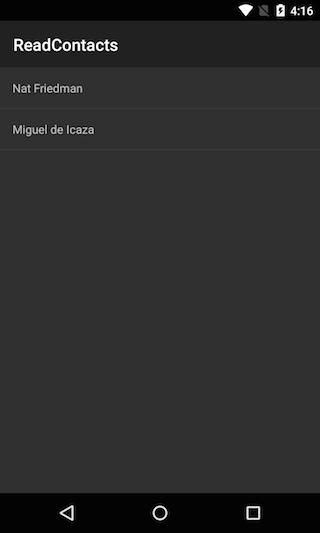

<a name="Recipe" class="injected"></a>

# Recipe

[ ](Images/readcontacts.png)

Follow these steps to query contacts.

1.  Double-click the project in Visual Studio and navigate to project Properties.
2.  Select the Android Application panel in the Project Options dialog in the Properties navigator in VS.
3.  Click the Add Android Manifest button.
4.  Under Required permissions set the `READ_CONTACTS` permission and press OK.
5.  Add a file named **ContactItemView.axml** under the Resources/layout folder containing the following XML.


```
<?xml version="1.0" encoding="UTF-8" ?>
<TextView xmlns:android="http://schemas.android.com/apk/res/android"
    android:layout_width="fill_parent"
    android:layout_height="fill_parent"
 android:padding="15dip"/>
```

In a `ListActivity` subclass, add the following code to the `OnCreate` method:

```
var uri = ContactsContract.Contacts.ContentUri;

string[] projection = { ContactsContract.Contacts.InterfaceConsts.Id,
       ContactsContract.Contacts.InterfaceConsts.DisplayName };

var cursor = ContentResolver.Query(uri, projection, null, null, null);

var contactList = new List<string> ();

if (cursor.MoveToFirst ()) {
       do {
              contactList.Add (cursor.GetString (
                      cursor.GetColumnIndex (projection [1])));
       }  while (cursor.MoveToNext());
}

ListAdapter = new ArrayAdapter<string> (this,
       Resource.Layout.ContactItemView, contactList);
```

<a name="Additional_Information" class="injected"></a>

# Additional Information

`ContactsContract.Contacts` is the data contract that is used to interface with
contact data. The code queries contacts at the Uri defined by
`ContactsContract.Contacts.ContentUri`, returning the columns selected from
`ContactsContract.Contacts.InterfaceConsts`. It adds the results to
`List<string>` instance that is used to bind to the user interface through
an `ArrayAdapter`.
