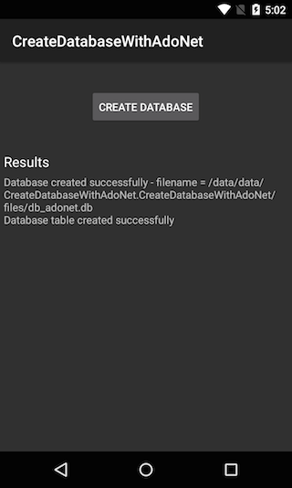

# Requirements
There are no special requirements for this recipe, but you may need to set the correct permission if you have your phone set to save applications, or data, to the SDCard.
You can find this by going into <uiitem>Project -> CreateDatabaseWithAdoNet Options -> Android Application</uiitem>. In the
required permissions box, select <uiitem>WriteExternalStorage</uiitem>, as illustrated below:


<a name="Recipe" class="injected"></a>


# Recipe

Xamarin.Android has an ADO.NET implementation of SQLite inside the assembly
`Mono.Data.SQLite`

1. Add a reference to `System.Data` and to Mono.Data.SQLite:

 

2. To create your database, use the `SqliteConnection` class and call the static `CreateFile` method.
You will need to provide a path to the database, as well as the name of the database as a parameter.

The following snippet contains a call to the `Path.Combine` method.
If you are using the `Android.Graphics` namespace within the source file that you set up the database in, you will
need to explicitly state the use of `System.IO`, as `Android.Graphics` also contains a `Path` class. `Android.Environment`
has a class called `Environment`, so again, the `System` namespace will need to be explicitly used if you are using the
`Android.Environment` namespace.

The following snippet demonstrates both set ups:

```
// with Android.Graphics & Android.Environment
var docsFolder = System.Environment.GetFolderPath(System.Environment.SpecialFolder.MyDocuments);
var pathToDatabase = System.IO.Path.Combine(docsFolder, "db_adonet.db");
SqliteConnection.CreateFile(pathToDatabase);

// without Android.Graphics & Android.Environment
using System.IO;

var docsFolder = Environment.GetFolderPath(Environment.SpecialFolder.MyDocuments);
var pathToDatabase = Path.Combine(docsFolder, "db_adonet.db");
SqliteConnection.CreateFile(pathToDatabase);
```
<ol start="3">
  <li> It is important to test to ensure the file has been created. This can be achieved using either a <code>try</code>/<code>catch</code> or to simply use <code>if (!File.Exists)</code> and test the return value. The following snippet demonstrates both:</li>
</ol>
```
// with try / catch
try
{
    var docsFolder = Environment.GetFolderPath(Environment.SpecialFolder.MyDocuments);
    var pathToDatabase = Path.Combine(docsFolder, "db_adonet.db");
    SqliteConnection.CreateFile(pathToDatabase);
}
catch (IOException ex)
{
    var reason = string.Format("The database failed to create - reason {0}", ex.Message);
    Toast.MakeText(myContext, reason, ToastLength.Long).Show();
}

// using File.Exists
if (!File.Exists(pathToDatabase))
{
    var reason = string.Format("The database failed to create - reason {0}", ex.Message);
    Toast.MakeText(myContext, reason, ToastLength.Long).Show();
}
```
<ol start="4">
  <li> To create a table within the database, a command has to be created and executed. As with the creation, the insertion should be enclosed within a <code>try</code>/<code>catch</code>. The following snippet demonstrates how to create a table and enclose it within a <code>try</code>/<code>catch</code>. The example here uses the async methods (but they can be equally replaced with the non-async methods) to create a table called “People.”</li>
</ol>

```
// create a connection string for the database
var connectionString = string.Format("Data Source={0};Version=3;", pathToDatabase);
            try
{
    using (var conn = new SqliteConnection((connectionString)))
    {
        await conn.OpenAsync();
        using (var command = conn.CreateCommand())
        {
            command.CommandText = "CREATE TABLE People (PersonID INTEGER PRIMARY KEY AUTOINCREMENT, FirstName ntext, LastName ntext)";
            command.CommandType = CommandType.Text;
            await command.ExecuteNonQueryAsync();
        }
    }
}
catch (Exception ex)
{
    var reason = string.Format("Failed to insert into the database - reason = {0}", ex.Message);
    Toast.MakeText(myContext, reason, ToastLength.Long).Show();
}
```

The sample code for this recipe creates a database with the result displayed, when the button is pressed. This is
illustrated below:

[]

