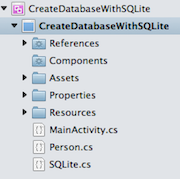

# Recipe

This recipe can be used on iOS or Android as a non-PCL Xamarin.Forms application. The example snippets are agnostic to the
platform, but the associated downloads show how to incorporate them within your apps.

1. Create your application.
2. Add the Sqlite-Net nuget package by Frank Kreuger.
3. Create a file called Person.cs. This will contain the table for the database. The following code snippet demonstrates how to set up the table:

```
public class Person
{
     [PrimaryKey, AutoIncrement]
     public int ID { get; set; }

     public string FirstName { get; set; }

     public string LastName { get; set; }

     public override string ToString()
     {
        return string.Format("[Person: ID={0}, FirstName={1}, LastName={2}]", ID, FirstName, LastName);
     }
}
```

The overload for `ToString()` near the end of the code snippet is used to aid in debugging, but depending on what is being
displayed during the debug session, may take a while to render (for example, complex data structures). It does not have an impact
outside of debugging, so can be safely included. `[PrimaryKey, AutoIncrement]` requires `using SQLite;` to be inserted at the top
of the source file.

The SQLite table class cannot contain a number of commonly used types (including arrays, all generic classes and GUIDs).
If you wish to include these in your table classes, place `[Ignore]` before the property.

Your file tree should look like this:

 

1. The first step in the creation of the database is to create a connection. The following snippet shows how to connect using
the `createDatabase` method:

```
private string createDatabase(string path)
{
    try
    {
        var connection = new SQLiteAsyncConnection(path);
             connection.CreateTableAsync<Person>();
             return "Database created";
    }
    catch (SQLiteException ex)
    {
        return ex.Message;
    }
}
```

<ol start="2">
  <li>SQLite has 4 key methods for the insertion or updating of data; <code>Insert</code>, <code>Update</code>, <code>InsertAll</code> and <code>UpdateAll</code>.</li>
</ol>

<code>Insert</code> and <code>InsertAll</code> returns <code>0</code> if the data doesn’t exist already in the table and the data inserted. If the value is
non-zero, then the data exists and the <code>Update</code> or <code>UpdateAll</code> is used. The following snippet shows how to perform this operation.

```
private string insertUpdateData(Person data, string path)
{
    try
    {
        var db = new SQLiteAsyncConnection(path);
            if (db.InsertAsync(data) != 0)
                db.UpdateAsync(data);
            return "Single data file inserted or updated";
    }
    catch (SQLiteException ex)
    {
        return ex.Message;
    }
}
```

To find the number of records in the database, `Count(*)` can be used as part of the SQLite query as shown in this code.
Depending on the size and complexity of the database, using `Count(*)` as a parameterless query can be slow.

```
private int findNumberRecords(string path)
{
    try
    {
        var db = new SQLiteAsyncConnection(path);
        // this counts all records in the database, it can be slow depending on the size of the database
        var count = db.ExecuteScalar<int>("SELECT Count(*) FROM Person");

        // for a non-parameterless query
        // var count = db.ExecuteScalar<int>("SELECT Count(*) FROM Person WHERE FirstName="Amy");

        return count;
      }
      catch (SQLiteException ex)
      {
          return -1;
      }
  }
```

