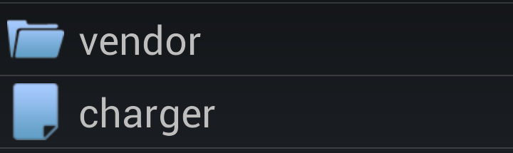

<a name="Recipe" class="injected"></a>


# Recipe

> ℹ️ **Note**: This recipe requires a reference to Xamarin.Android.Support.V4, which is available in nuget.

This recipe has two key architectural components:

1.  A  `ListFragment` subclass called  `FileListFragment` .
1.  An  `ArrayAdapter` subclass called  `FileListAdapter` .

 `FileListFragment` is responsible for building a list of `FileSystemInfo` objects for each file or subdirectory in the current
directory. The `FileSystemInfo` is the base class for the `FileInfo` and `DirectoryInfo`. This list will then serve
as the dataset for the the `FileListAdapter` class that is used for
binding data to the `ListView` that is encapsulated by `FileListFragment`.

The `FileListAdapter` will contain logic to differentiate between `FileInfo` objects and `DirectoryInfo` objects and display
that informationas a row in the `ListView`. To do this, the `FileListAdapter` will either inflate a view or recycle an exist
view, and then populate it with a `FileSystemInfo` object.

Each of these components is discussed in more detail in the sections
below.

 <a name="FileListFragment" class="injected"></a>


### FileListFragment

In this recipe, there is a single activity that hosts the list
fragment. The code for the main activity of this recipe will not be covered. The core functionality is contained in a
fragment.

This recipe uses a subclass named `FileListFragment` to display
the contents of a directory. `FileListFragment` is a subclass of the
standard Android `ListFragment` class. A fragment is a class that
implements a portion of an Activity. A fragment allows for a more modular design
and makes it easier to adapt an application to different screen sizes and
orientations.

The fragment is created automatically when the Activity is loaded, as shown
in the following layout file:

```
<?xml version="1.0" encoding="utf-8"?>
<FrameLayout xmlns:android="http://schemas.android.com/apk/res/android"
    android:layout_width="match_parent"
             android:layout_height="match_parent">
  <fragment class="com.xamarin.recipes.filepicker.FileListFragment"
          android:id="@+id/file_list_fragment"
          android:layout_width="match_parent"
          android:layout_height="match_parent" />
</FrameLayout>
```

When the fragment is created the lifecycle method `OnCreate` will
be called. This is a simple method that will instantiate a `FileListAdapter` with an empty array of `FileSystemInfo`
objects, and set the `ListAdapter` property on `FileListFragment`:

```
public override void OnCreate(Bundle savedInstanceState)
{
    base.OnCreate(savedInstanceState);
    _adapter = new FileListAdapter(Activity, new FileSystemInfo[0]);
    ListAdapter = _adapter;
}
```

The next lifecycle method that is implemented on the fragment is `OnResume`. This method will create a list of files and subdirectories
in the current directory and provide that list to the `FileListAdapter`:

```
public override void OnResume()
{
    base.OnResume();
    RefreshFilesList(DefaultInitialDirectory);
}
```

The logic for updating the adapter is in the method `RefreshFileList`, shown below:

```
public void RefreshFilesList(string directory)
{
    IList<FileSystemInfo> visibleThings = new List<FileSystemInfo>();
    var dir = new DirectoryInfo(directory);
    try
    {
        foreach (var item in dir.GetFileSystemInfos().Where(item => item.IsVisible()))
        {
            visibleThings.Add(item);
        }
    }
    catch (Exception ex)
    {
        Log.Error("FileListFragment", "Couldn't access the directory " + _directory.FullName + "; " + ex);
        Toast.MakeText(Activity, "Problem retrieving contents of " + directory, ToastLength.Long).Show();
        return;
    }
    _directory = dir;
    // Empty out the adapter and add in the FileSystemInfo objects
    // for the current directory.
    _adapter.Clear();
    _adapter.AddDirectoryContents(visibleThings);
    // If we don't do this, then the ListView will not update itself when then data set
    // in the adapter changes. It will appear to the user that nothing has happened.
    ListView.RefreshDrawableState();
    Log.Verbose("FileListFragment", "Displaying the contents of directory {0}.", directory);
}
```

The next method that needs to be overridden is `OnListItemClick`.
This method will be invoked each time the user taps on a row in the `ListView`. The code for this method can be seen below:

```
public override void OnListItemClick(ListView l, View v, int position, long id)
{
    var fileSystemInfo = _adapter.GetItem(position);
    if (fileSystemInfo.IsFile())
    {
        // Do something with the file.  In this case we just pop some toast.
        Log.Verbose("FileListFragment", "The file {0} was clicked.", fileSystemInfo.FullName);
        Toast.MakeText(Activity, "You selected file " + fileSystemInfo.FullName, ToastLength.Short).Show();
    }
    else
    {
        // Dig into this directory, and display it's contents
        RefreshFilesList(fileSystemInfo.FullName);
    }
    base.OnListItemClick(l, v, position, id);
}
```

In this method, a `FileSystemInfoobject` is retrieved from the
adapter for the row that was clicked. If the object is a file, then a Toast is
displayed with the full name of the file, otherwise `RefreshFilesListis` called with the name of the directory that the
user just tapped on.

 <a name="FileListAdapter" class="injected"></a>


### FileListAdapter

The next important component is the `FileListAdapter`, a subclass of
`ArrayAdapter`. The `ArrayAdapter` base class is an excellent choice when dealing
with dynamic lists that need to be displayed. It takes care of much of the work
that needs to be done in manage the list. An example of the rows that have
been populated by `FileListAdapter` can be seen in the following screenshot:

 [ ](Images/image2.png)

The first row shows the icon of a folder, and the name of the folder. The
second row shows an icon for a file, and the name of the file. To
create a view for these rows, the method `GetView` will be overridden.

The layout for the row, regardless if it is a file or a directory, is
displayed using the same XML layout:

```
<?xml version="1.0" encoding="utf-8"?>
<LinearLayout
  xmlns:android="http://schemas.android.com/apk/res/android"
  android:layout_width="fill_parent"
  android:layout_height="wrap_content"
  android:orientation="horizontal">
  <ImageView
         android:id="@+id/file_picker_image"
         android:layout_width="40dip"
         android:layout_height="40dip"
         android:layout_marginTop="5dip"
         android:layout_marginBottom="5dip"
         android:layout_marginLeft="5dip"
         android:src="@drawable/file"
         android:scaleType="centerCrop"/>
  <TextView
         android:id="@+id/file_picker_text"
         android:layout_width="fill_parent"
         android:layout_height="wrap_content"
         android:layout_weight="1"
         android:layout_gravity="left|center_vertical"
         android:textSize="28sp"
         android:layout_marginLeft="10dip"
         android:singleLine="true"
         android:text="filename"/>
</LinearLayout>
```

The implementation of `GetView`, is shown next, followed by an
explanation:

```
public override View GetView(int position, View convertView, ViewGroup parent)
{
    var fileSystemEntry = GetItem(position);
    FileListRowViewHolder viewHolder;
    View row;
    if (convertView == null)
    {
        row = _context.GetLayoutInflater().Inflate(Resource.Layout.file_picker_list_item, parent, false);
        viewHolder = new FileListRowViewHolder(row.FindViewById<TextView>(Resource.Id.file_picker_text), row.FindViewById<ImageView>(Resource.Id.file_picker_image));
        row.Tag = viewHolder;
    }
    else
    {
        row = convertView;
        viewHolder = (FileListRowViewHolder)row.Tag;
    }
    viewHolder.Update(fileSystemEntry.Name, fileSystemEntry.IsDirectory() ? Resource.Drawable.folder : Resource.Drawable.file);
    return row;
}
```

In this code, the `FileSystemInfo` object at the specified index
is retrieved from the underlying list that the `ArrayAdapter` base
class maintains. Once the relevant `FileSystemInfo` object has been
obtained, it is necessary to populate and return a view.

In the name of performance, a `ListView` may recycle existing
rows. This recycled row is passed in as the `convertView` parameter.
The code checks to see if `convertView` is null. If `convertView` is null then a new view for the row will be inflated
using the XML layout that was specified above.

 <a name="FileListRowViewHolder" class="injected"></a>


#### FileListRowViewHolder

Of interest is the `FileListRowViewHolder` class that is used by `GetView`. This class is another performance optimization. To display
the icon and the name of the `FileSystemObject` requires that a
reference to the `ImageView` and `TextView` that are used
by the layout. In the case of a recycled view this is unnecessary – the calls
to `FindViewById` are wasteful.

When a new view is created for a row, a new instance of `FileListRowViewHolder` is created which holds the reference to the `ImageView` and the `TextView`. It is stored with View, in
the .Tag property.

For a recycled view, it is not necessary to make a call to `FindViewById` to obtain a reference to the `ImageView`
and `TextView` each time. The `.Tag` property on the view holds an
instance of `FileListRowViewHolder` already has the references to the
two widgets.

The code for `FileListRowHolder` can be seen below:

```
public class FileListRowViewHolder : Java.Lang.Object
{
    public FileListRowViewHolder(TextView textView, ImageView imageView)
    {
        TextView = textView;
        ImageView = imageView;
    }
    public ImageView ImageView { get; private set; }
    public TextView TextView { get; private set; }
    public void Update(string fileName, int fileImageResourceId)
    {
        TextView.Text = fileName;
        ImageView.SetImageResource(fileImageResourceId);
    }
}
```

Notice as well that `FileListRowHolder` subclasses `Java.Lang.Object`. That is because the datatype of `View.Tag` is not a `System.Object`, but is `Java.Lang.Object`.

When the application is run, the [ListView](http://developer.android.com/reference/android/widget/ListView.html) will display the contents of the root directory on
the device as show below:

 [ ](Images/image1.png)

Note the icon distinguishing between a directory and a file. When the
user taps on a directory, the contents of the [ListView](http://developer.android.com/reference/android/widget/ListView.html)will change to reflect what is in the new directory.

When the user selects a file, then a Toast will pop up showing the full path
and filename of the file that was selected, as shown in the screen shot
below:

 [ ](Images/image3.png)

 <a name="Additional_Information" class="injected"></a>


# Additional Information

The application in this recipe provides a quick example of how one may browse
the file system on an Android device. Additional functionality can be added to
support tablets, or perform some meaningful action on selected files.

