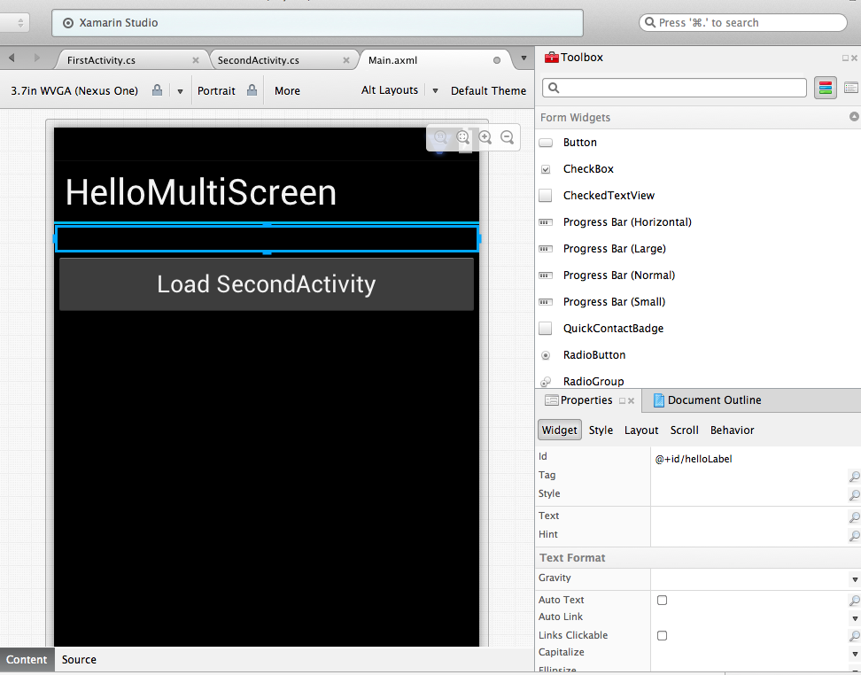
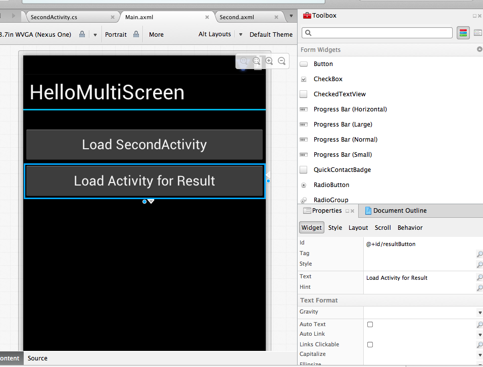
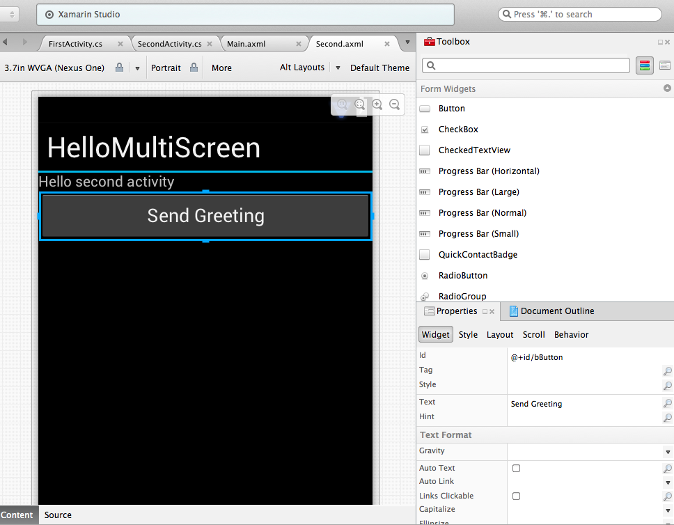

# Recipe

We've learned how to pass data from the first Activity to the second,
but what if you want to pass data from the second Activity back to the first?
One option is to let Android know that you plan to launch the second Activity
with the expectation of getting some result back. We can do with with `StartActivityForResult`.

In our example, we will pass a greeting string from the second Activity back to the first.
Let's begin by launching the designer and adding a few extra elements to our layout. Open up `Main.axml`
and add a label right under the title. We will use this label to display the greeting text sent over from the second Activity.
Call this label *helloText*:

 [ ](Images/05.png)

Next, add a button called *resultButton*. We will use this button to launch the second Activity with `StartActivityForResult`:

 [ ](Images/06.png)

Finally, open up `Second.axml` and add a button called *helloButton*:

 [ ](Images/07.png)

Next, add the following code to the `OnCreate` method of the `FirstActivity` to wire up the *resultButton* click to launching the second Activity with `StartActivityForResult`:

```
var resultButton = FindViewById<Button> (Resource.Id.resultButton);

resultButton.Click += delegate {
  var myIntent = new Intent (this, typeof(SecondActivity));
  StartActivityForResult (myIntent, 0);
};
```

In `SecondActivity`, wire up the *helloButton* in the `OnCreate` button:

```
var helloButton = FindViewById<Button> (Resource.Id.helloButton);

helloButton.Click += delegate {
  Intent myIntent = new Intent (this, typeof(FirstActivity));
  myIntent.PutExtra ("greeting", "Hello from the Second Activity!");
  SetResult (Result.Ok, myIntent);
  Finish();
};
```

Set the data to be sent back to the first Activity with `SetResult`, passing in the result status and the data (in this case, our Intent). When you're through with passing the data, let Android know you're done by calling `Finish`.

To handle the result in the first Activity, we will override a method called `OnActivityResult`. This will listen for our result code and the Intent that we passed into `SetResult` in the second Activity:

```
protected override void OnActivityResult(int requestCode, Result resultCode, Intent data)
{
  base.OnActivityResult(requestCode, resultCode, data);
  if (resultCode == Result.Ok) {
     var helloLabel = FindViewById<TextView> (Resource.Id.helloLabel);
     helloLabel.Text = data.GetStringExtra("greeting");
  }
}
```

Finally, we will display the string that we passed to the first Activity as a greeting in the first Activity.

