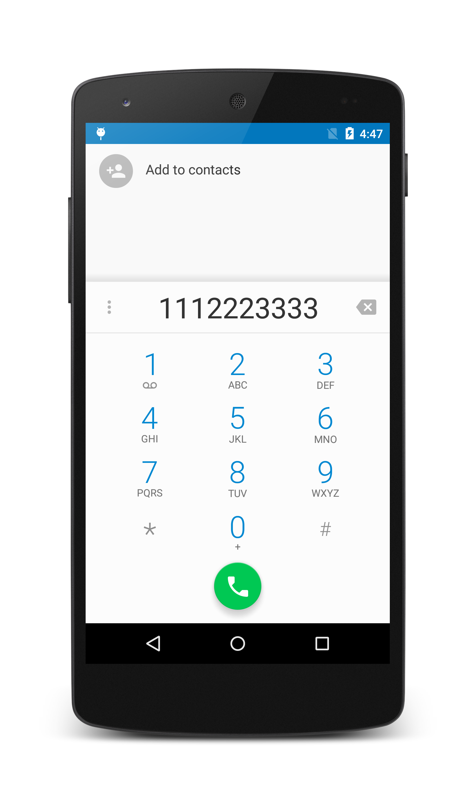

<a name="Recipe" class="injected"></a>

Each screen in an application is represented by an activity. Using an
asynchronous message called an *intent* causes the system to load
another activity (and another screen) to handle that type of intent. An
intent that is created from a `Uri` causes the system to load an
activity that can handle the `Uri` scheme. In this recipe, a `Uri`
beginning with `tel:` loads an activity in the phone dialer
application, and the number following the `tel:` prefix is
automatically loaded into the dialer.

# Recipe

[ ](Images/01-main-activity.png)
[ ](Images/02-dialer-activity.png)

1.  Create a new Xamarin.Android application. The project template will
    create a single activity named *Activity1* (**MainActivity.cs**), which
    contains a button.

2.  From the `button.Click` handler in **MainActivity.cs**, create a
    `Uri` and a dialer `Intent`.

3.  Call `StartActivity` to launch the intent.

The following code sample illustrates the updated `button.Click`
handler:

```
intent.button.Click += delegate {
   var uri = Android.Net.Uri.Parse ("tel:1112223333");
   var intent = new Intent (Intent.ActionDial, uri);
   StartActivity (intent);
};
```

In this code example, calling `StartActivity` and passing it the
`ActionDial` intent launches the phone dialer app. The dialer activity
in the phone dialer app is automatically loaded with the number
`1112223333` when it starts - the user can view this number
before pressing the <em>Call</em> button. The `ActionCall` intent is
not used here because `ActionCall` would initiate the call directly;
instead, we use the `ActionDial` intent so that the user can control
the call from the dialer. Note that you do not have to set the
`CALL_PHONE` permission to use the `ActionDial` intent.

