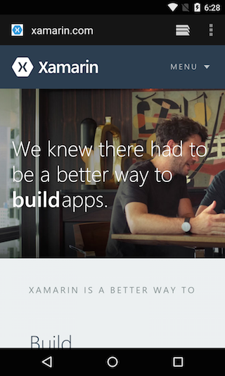

<a name="Recipe" class="injected"></a>


# Recipe

 [ ](Images/Browser.png)

1.  Create a new Xamarin.Android application. The project template will create a single activity named Activity1 (MainActivity.cs), which contains a button.
2.  From the `button.Click` handler in MainActivity.cs, create a `Uri` and an `Intent`.


```
intent.button.Click += delegate {
       var uri = Android.Net.Uri.Parse ("http://www.xamarin.com");
       var intent = new Intent (Intent.ActionView, uri);
       StartActivity (intent);
};
```

Calling `StartActivity` and passing it the `Intent` in the above code launches
the browser app.

 <a name="Additional_Information" class="injected"></a>


# Additional Information

Each screen in an application is represented by an activity. Using
asynchronous messages called intents, when created from a Uri, causes the system
to load an activity that can handle the Uri scheme. In this recipe a Uri
beginning with http:// loads an activity from the browser application to display
the page.

