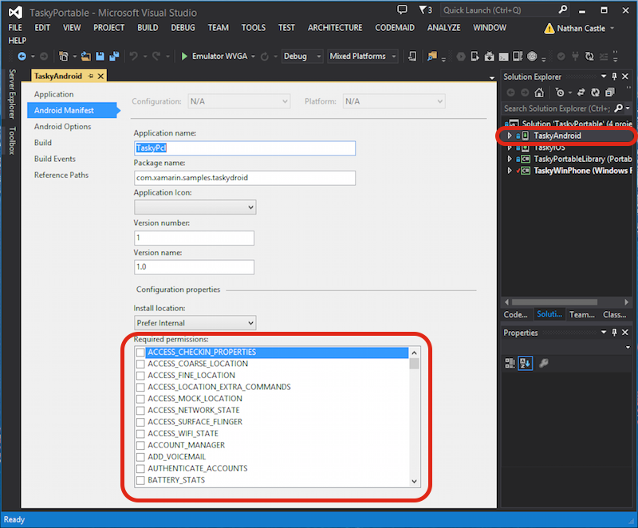
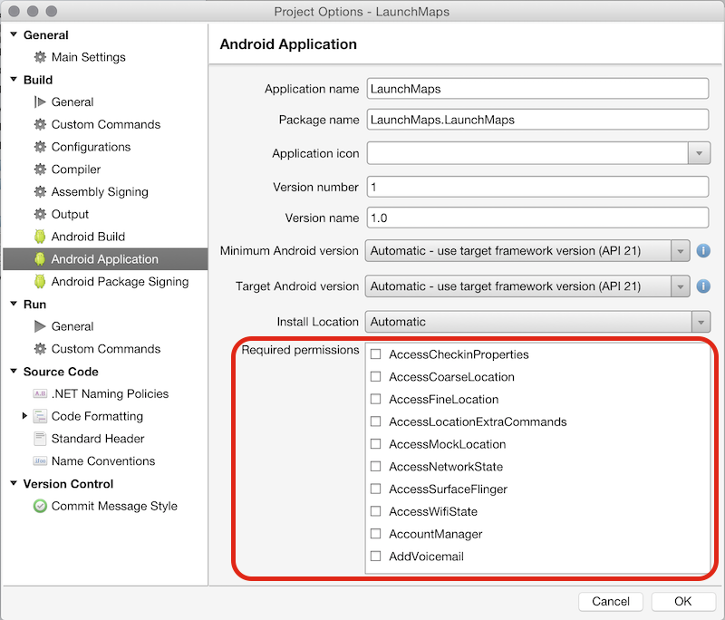

# Recipe

To edit Android Manifest permissions for your project:

## Visual Studio

1.  Right-click on your android project and select **Properties**.
2.  Select **Android Manifest** in the window that opens.
3.  Check the permissions that you want to require in the list of permissions.

## Visual Studio for Mac

1.  Right-click on your android project and select **Options**.
2.  Select **Android Application** in the window that opens.
3.  Check the permissions that you want to require in the list of permissions.

# Additional Information

You should only request permissions that your application requires to run.
Users will be prompted to allow these permissions when they download your
application from the Google Play Store.

Common permissions include:

 `INTERNET` – for accessing network resources.

 `ACCESS_COARSE_LOCATION and ACCESS_FINE_LOCATION` – for location
services.

 `CAMERA` – to access the camera.

There are many more permissions relating to contacts, phone operations,
operating system information, time and alarm settings and hardware features.

