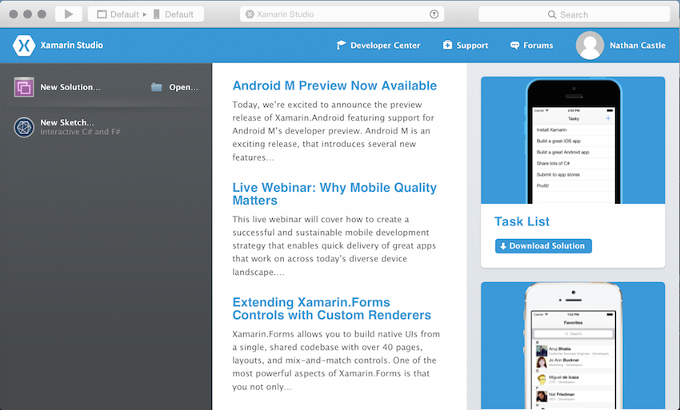
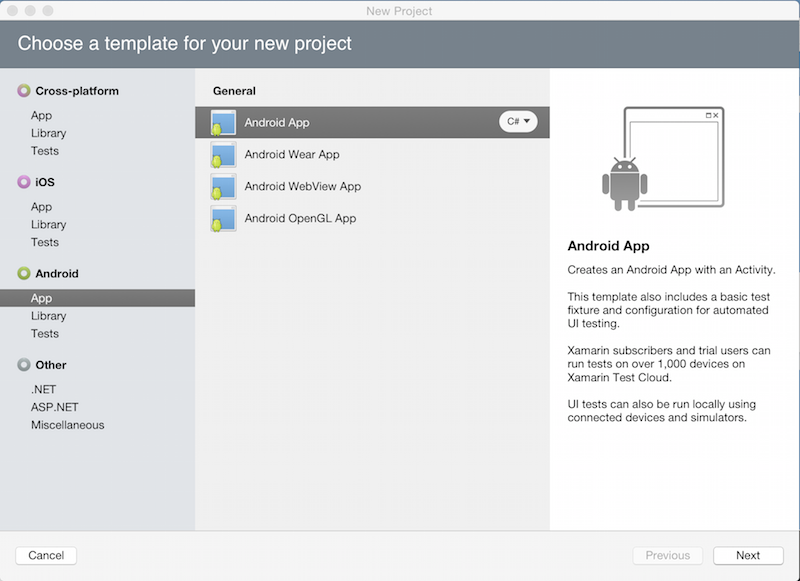
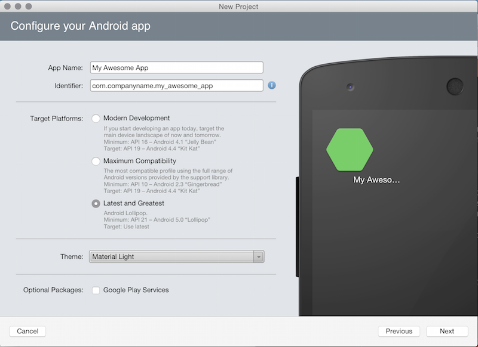
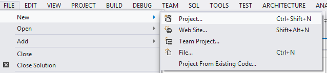
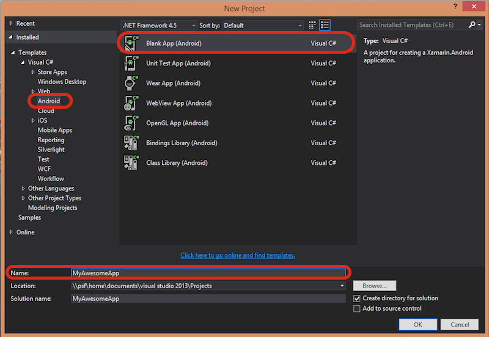

# Recipe

## Visual Studio for Mac

1.  First, launch Visual Studio for Mac and click on **New...** in the top left corner: 
2.  A window will pop up with a list of options for the types of projects available to you. To create an Android project, select the Android>App category to open up the available sub-categories, then choose Android App: 
3.  Choose a sensible name for your app and choose development targets: 
4.  Choose a project name, then click **OK**:  
    
5.  Visual Studio for Mac will create and populate a new project for you: 

## Visual Studio

1.  First, launch Visual Studio and click on **New Project...** in the top left corner: 
2.  A window will pop up with a list of options for the types of projects available to you. To create an Android project, select the Android then **Blank App (Android)**. Enter a project name: 
3.  Visual Studio will create and populate a new project for you: 

</ide>

## Additional Information

If you are using periods in your project name, do not use *Android* in your project name, as this will result in namespace conflicts and build failures. For example, do not name your project "Hello.Android" - use "Hello.Droid" instead.

