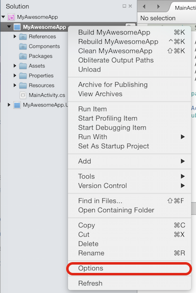
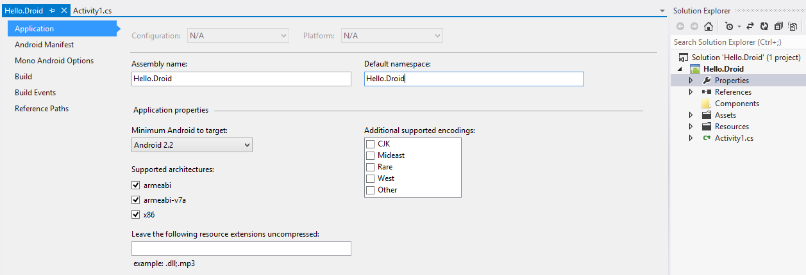

# Recipe

## Visual Studio for Mac

1.  Double click on the project in the **Solution Pad**, or right-click on the project and select **Options**: 
2.  Choose main settings and you'll be able to edit the default namespace: 
3.  This value will be automatically set as the root namespace in each new code file you create in your project.

## Visual Studio

1.  Open the project **Properties**, and then choose the **Application** panel: 
2.  This value will be automatically set as the root namespace in each new code file you create in your project.

# Additional Information

If you edit the default namespace value in an existing project,
it will *NOT* update existing files, so beware that editing this value will result in two different
root namespaces in your project.

Xamarin.Android applications use the Default namespace for the `/Resources/Resource.Designer.cs` generated file. If the default namespace is
changed in an existing project, then existing references to Resource will be
broken. The error will read “The name ‘Resource’ does not exist in the current context,” as
illustrated by the following screenshot:

 

 `Resource.Designer.cs` should not be edited directly. To fix these errors
either:

-  Update the namespace in the affected files to match the new Default namespace, or
-  Add a using statement to the affected files, referencing the new Default namespace.

