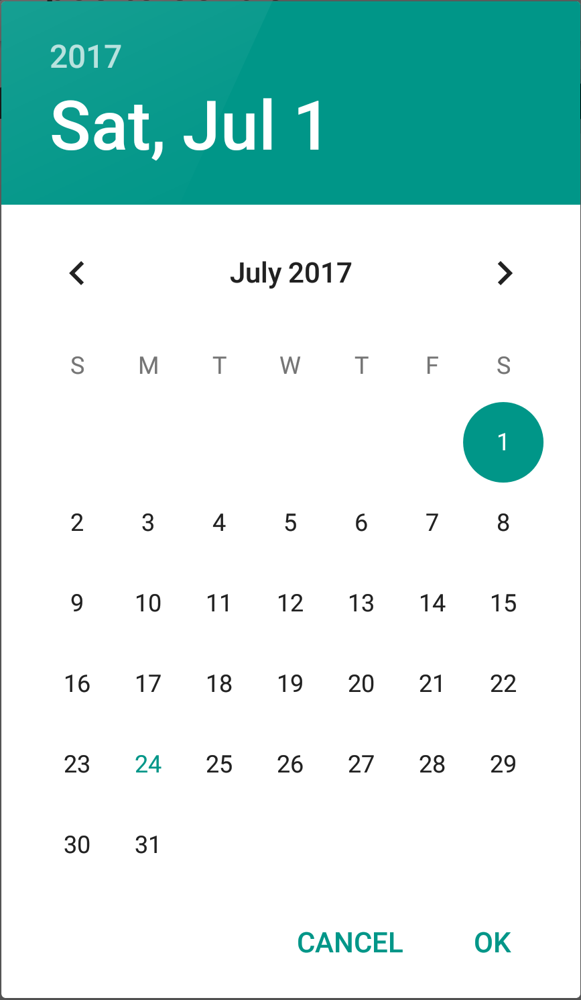

# Recipe

A _compound view_ is a view that encapsulates number of other views to encapsulate some functionality, making it easy to reuse the layout and functionality throughout an application. As a minimum, a custom view should subclass `Android.Views.View`.

This recipe will highlight some of the key steps involved with creating a compound view called the **DatePickerTextView**. The compound view will subclass `LinearLayout` and contain a `TextView` and an `ImageButton`. The `TextView` will display a date. When the user taps the image button, the custom view will display a `DatePickerDialog` so that the user may select a new date. The following XML shows how to add the DatePickerTextView to the XML layout for an Activity or a Fragment:

```xml
<com.xamarin.recipes.compositecontrol.DatePickerTextView
    android:id="@+id/date_picker_view"
    android:layout_width="match_parent"
    android:layout_height="match_parent"
    app:date="2017-07-01"
/>
```

Notice that this compound view also has a custom property, `date`, that is used to initialize the date displayed in the custom widget.

The view itself will look something like this when rendered on an Android phone:

[ ](Images/compoundview-01.png)

Clicking on the `ImageButton` in the view will display the native Android `DatePicker` widget:

[ ](Images/compoundview-02.png)


This recipe will briefly discuss the following steps:

1. **Creating a Layout** &ndash;  Assemble the necessary widgets into an XML layout file that will be inflated by the custom view.
1. **Subclass A View** &ndash; The `LinearLayout` will be the base class for the DatePickerTextView.
4. **Add Custom Attributes** &ndash; Optional. Declare the attributes that can be set in the XML layout.
2. **Inflate the Layout** &ndash; This recipe will inflate an Android layout file and display that to the user.
3. **Preserve and Restore State** &ndash; It may be necessary to preserve the state of the view during a configuration change.
5. **Adding the View to a Layout** &ndash; Finally, the compound view will be added the layout for an Activity.

Each of these items will be covered in more detail in the following sections.

## Creating the Layout

The first step in this recipe is to create the layout file, **date_picker_layout.axml**. Android requires that each layout file have one root element that will act as a container. In this particular example, it may seem logical to use a `LinearLayout` as the root view, however this approach is sub-optimal. As will be seen in the next section, the DatePickerTextView will extend `LinearLayout`, it is not necessary to add a child `LinearLayout` as a container within a container. Doing so would create more work for Android as the layout subsystem must inflate and display that superfluous widget. To simplify the view hierarchy, this recipe makes use of the `<merge>` element. The `<merge>` element fulfills the requirement of having a single root element for the view and keeps the view hierarchy simple. When inflating this layout, Android will take all of the child elements of the `<merge>` and add them to the parent of the view hierarchy.

The contents of **date_picker_layout.axml** are displayed in the following XML snippet:

```xml
<?xml version="1.0" encoding="utf-8"?>
<merge xmlns:android="http://schemas.android.com/apk/res/android"
    xmlns:app="http://schemas.android.com/apk/res-auto">
    <TextView
        android:textAppearance="?android:attr/textAppearanceLarge"
        android:layout_width="wrap_content"
        android:layout_height="wrap_content"
        android:id="@+id/date_text_view"
        android:gravity="fill_vertical" />
    <Space
        android:layout_width="0dp"
        android:layout_height="0dp"
        android:layout_weight="1" />
    <ImageButton
        android:layout_width="wrap_content"
        android:layout_height="wrap_content"
        app:srcCompat="@drawable/ic_today_black_24dp"
        android:src="@drawable/ic_today_black_24dp"
        android:gravity="right"
        android:id="@+id/pick_date_button" />
</merge>
```


The `<Space>` element is used to occupy the un-used space between the `TextView` and the `ImageButton`.

Finally, the drawable that is displayed in the `ImageButton` is an SVG image. Because of this, the  `ImageButton` uses the both the `android:src` and the `app:srcCompat`. Devices running API level 21 or higher will the value of `android:src` and load the SVG drawable. In contrast, older versions of Android will receive SVG support via the [Android Support Library v7 App Compat](https://www.nuget.org/packages/Xamarin.Android.Support.v7.AppCompat/) and load the the image using the value of the `app:srcCompat` attribute.

## Subclassing `LinearLayout`

In general, a custom view should try to subclass an existing Android `View` that is similar in functionality. This recipe will extend the `LinearLayout` which is the closest View for defining the basic layout of the DatePickerTextView.

There are three constructors provided by the `View` base class and a custom view should implement all three of them. Each of these constructors should call the corresponding constructor from the base class and perform any initialization that the view requires. In many cases, it is common to place the initialization logic in a single private method name `Initialize` and calling that method from each constructor. The `Initialize` method has the responsible of performing all the initializations necessary for the view, such as inflating the layout, setting any properties on the root `LinearLayout`, and reading the custom attributes that are defined by for this view. In this recipe, the constructor parameters are collected into a `Tuple` which is passed to the `Initialize` method.

This code snippet shows the three constructors from the `DatePickerTextView` class:

```csharp
public class DatePickerTextView : LinearLayout
{
    public DatePickerTextView(Context context) : base(context)
    {
        Initialize(Tuple.Create<Context, IAttributeSet, int>(context, null, 0));
    }

    public DatePickerTextView(Context context, IAttributeSet attrs) : base(context, attrs)
    {
        Initialize(Tuple.Create(context, attrs, 0));
    }

    public DatePickerTextView(Context context, IAttributeSet attrs, int defStyle) : base(context, attrs)
    {
        Initialize(Tuple.Create(context, attrs, defStyle));
    }
}
```


The first constructor, `DatePickerTextView(Context context)` is used when the app is programmatically instantiating the view. The  other two constructors are used by Android when it is inflating the view.

## Adding and Reading Custom Attributes

Custom attributes are added to a view by creating a resource file which declares the attributes of the view.  The custom view will use the `Context.ObtainStyledAttributes` method to read the attributes from the XML layout and store them into a `Android.Content.Res.TypedArray` object. This class provides methods to access the values.

### Declaring the Custom Attributes

The individual attributes are identified by `<attr>` elements that children of the `<declare-styleable>` element. The custom view must implement the logic to map the custom attributes from the `declare-styleable` resource. The `<attr>` specifies two key pieces of information:

1. **`name`** &ndash; The name of the attribute that will be used in the XML layout.
2. **`format`** &ndash; This attribute tells Android what type this property represents.

The following snippet is stored in the **values/attrs.xml** property of the sample project and declares one attribute for the view, `date`. Android does not recognize a date for an attribute value type; the DatePickerTextView will accept the date as a string andy try to parse that as a `System.DateTime`. The following XML is how the `date` attribute is defined:

```xml
<?xml version="1.0" encoding="utf-8"?>
<resources>
    <declare-styleable name="DatePicker">
        <attr name="date" format="string" />
    </declare-styleable>
</resources>
```

When Android goes to build and package the application, it will create two new resource ids to simplify programatic access:

* **`Resource.Styleable.DatePicker`** &ndash; This resource id is used to help Android create a `TypedArray` object that will hold the values from the XML layout.
* **`Resource.Styleable.DatePicker_date`** &ndash; This resource id is used to read the value of the `date` attribute from the XML declaring this code in the app.

The next section will discuss how these two resource ids are used by the `DatePickerTextView` class to read the attribute values from the XML layout.

### Reading the Custom Attribute Values from the XML Layout into a TypedArray

A custom view will use the `Context.ObtainStyledAttributes` method to map the XML attributes to a `TypedArray` object, which will provide programmatic access to the XML attributes. This snippet shows how to load the XML attributes into a `TypedArray` (the `InitializeDateFromCustomViewAttributes` is a method that was written to encapsulate the logic for reading the date attribute from the XML layout):

```csharp
void InitializeStyleAttributeProperties(Context context, IAttributeSet attrs)
{
    if (context == null)
    {
        return;
    }

    Android.Content.Res.TypedArray typedArray = context.ObtainStyledAttributes(attrs, Resource.Styleable.DatePicker);
    InitializeDateFromCustomViewAttributes(typedArray);
}
```

Once the `TypedArray` has been instantiated, it is possible to read the `date` attribute using code similar to this method in the `DatePickerTextView` class:

```csharp
void InitializeDateFromCustomViewAttributes(Android.Content.Res.TypedArray typedArray)
{
    string newDateValue = typedArray.GetString(Resource.Styleable.DatePicker_date);
    if (string.IsNullOrWhiteSpace(newDateValue))
    {
        this.theDate = DateTime.Now;
    }
    else
    {
        if (!DateTime.TryParse(newDateValue, out this.theDate))
        {
            throw new ArgumentException("Could not parse the `date` value from the widget attributes for the DatePickerTextView.");
        }
    }
}
```

## Inflating the Layout

The compound view must inflate the layout contained in the file **date_picker_layout.axml**  and add those widgets as children. This is done using a `LayoutInflater` is obtained from the `Context`:

```csharp
void InflateLayout(Context context)
{
    LayoutInflater inflater = LayoutInflater.FromContext(context);
    inflater.Inflate(Resource.Layout.date_picker_layout, this);

    textView = FindViewById<TextView>(Resource.Id.date_text_view);

    dateButton = FindViewById<ImageButton>(Resource.Id.pick_date_button);
    dateButton.Click += DateButton_Click;
}
```

In this recipe, the custom view will obtain and hold references to it's child views and set event handlers where necessary. The `DateButton_Click` method will display a `DialogFragment` hosting a `DatePickerDialog` for the user to select a date. When the user selects a date, the `DatePickerTextView` will be notified and have it's own internal date value changed.

## Preserving State on Configuration Changes

It may be necessary for a custom view to persist it's own data during a configuration change. There are two things that are required to preserve the state:

1. **Set the `android:id` attribute in the layout** &ndash; Regardless of the view type, Android will only try to persist the state of the view if the `android:id` is set for the widget.
2. **Override the `View.OnSaveInstanceState`/`View.OnRestoreInstanceState`** &ndash; Android will call these two methods to save the state and to restore state state.

To save the state, the view should create a `Bundle` and store the state in it, as shown in the following snippet:

```csharp
protected override IParcelable OnSaveInstanceState()
{
    Bundle bundle = new Bundle();
    bundle.PutParcelable(KEY_PARENT_STATE, base.OnSaveInstanceState());
    bundle.PutString(KEY_DATEPICKER_STATE, textView.Text);
    return bundle;
}
```

To restore the state, Android will call `OnRestoreInstanceState`, passing an `IParcelable`. If the `state` is a `Bundle`, then the custom view can try and read any state that was persisted by `OnSaveInstanceState`:

```csharp
protected override void OnRestoreInstanceState(IParcelable state)
{
    var bundle = state as Bundle;
    if (bundle == null)
    {
        base.OnRestoreInstanceState(state);
        string date = bundle.GetString(KEY_DATEPICKER_STATE, "");
        if (string.IsNullOrWhiteSpace(date))
        {
            this.theDate = DateTime.Now;
        }
        else
        {
            SetDateInternal(date);
        }
    }
    else
    {
        base.OnRestoreInstanceState(state);
    }
}
```

# Summary

This recipe discussed some of the key steps in creating a new view for an Android app that encapsulates some of the views provided by the Android SDK. For the full details of how this recipe works, consult the [source code on GitHub](https://github.com/xamarin/recipes/tree/master/android/layout/custom_compound_view).
