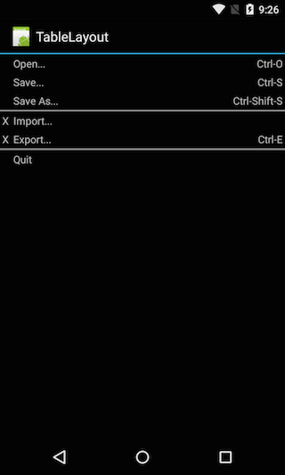

<a name="Recipe" class="injected"></a>

# Recipe

-  Create a new Xamarin.Android project named HelloTableLayout.
-  Open the file Resources/Layout/Main.axml and insert the following:

```
<?xml version="1.0" encoding="utf-8"?>
<TableLayout xmlns:android="http://schemas.android.com/apk/res/android"
    android:layout_width="fill_parent"
    android:layout_height="fill_parent"
    android:stretchColumns="1">

    <TableRow>
        <TextView
            android:layout_column="1"
            android:text="Open..."
            android:padding="3dip"/>
        <TextView
            android:text="Ctrl-O"
            android:gravity="right"
            android:padding="3dip"/>
    </TableRow>

    <TableRow>
        <TextView
            android:layout_column="1"
            android:text="Save..."
            android:padding="3dip"/>
        <TextView
            android:text="Ctrl-S"
            android:gravity="right"
            android:padding="3dip"/>
    </TableRow>

    <TableRow>
        <TextView
            android:layout_column="1"
            android:text="Save As..."
            android:padding="3dip"/>
        <TextView
            android:text="Ctrl-Shift-S"
            android:gravity="right"
            android:padding="3dip"/>
    </TableRow>


    <View
        android:layout_height="2dip"
        android:background="#FF909090"/>
    <TableRow>

        <TextView
            android:text="X"
            android:padding="3dip"/>
        <TextView
            android:text="Import..."
            android:padding="3dip"/>
    </TableRow>

    <TableRow>
        <TextView
            android:text="X"
            android:padding="3dip"/>
        <TextView
            android:text="Export..."
            android:padding="3dip"/>
        <TextView
            android:text="Ctrl-E"
            android:gravity="right"
            android:padding="3dip"/>
    </TableRow>

    <View
        android:layout_height="2dip"
        android:background="#FF909090"/>

    <TableRow>
        <TextView
            android:layout_column="1"
            android:text="Quit"
            android:padding="3dip"/>
    </TableRow>
</TableLayout>
```

Notice how this resembles the structure of an HTML table. The TableLayout
element is like the HTML `table` element; `TableRow` is like a `tr`
element; but for the cells, any kind of `View` element may be used. In this
example a `TextView` is being used for each cell. In between each cell there is a
basic `View` which is used to draw a horizontal line.

-  Make sure your HelloTableLayout Activity loads this layout in the `OnCreate()` method:


```
protected override void OnCreate (Bundle savedInstanceState)
{
    base.OnCreate (savedInstanceState);
    SetContentView (Resource.Layout.Main);
}
```

-  Run the application. You should see the following:


 

