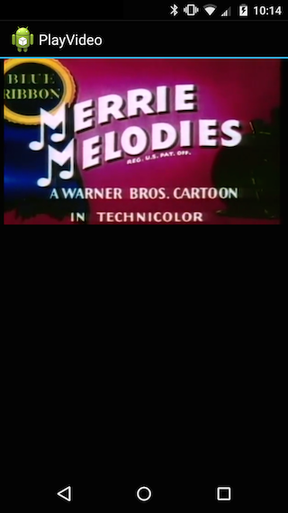

<a name="Recipe" class="injected"></a>

# Recipe

 [ ](Images/playvideo.png)

Follow these steps to play a video.

1.  Add a `VideoView` to an Xml layout.


```
<VideoView android:id="@+id/SampleVideoView"
        android:layout_width="fill_parent"
        android:layout_height="fill_parent">
</VideoView>
```

<ol start="2">
  <li>Obtain a reference to the <code>VideoView</code> in code.</li>
</ol>

```
var videoView = FindViewById<VideoView> (Resource.Id.SampleVideoView);
```

<ol start="3">
  <li>Create an <code>Android.Net.Uri</code> for the video.</li>
</ol>

```
var uri = Android.Net.Uri.Parse ("video url goes here");
```

<ol start="4">
  <li>Pass this <code>Uri</code> to the <code>VideoView</code>.</li>
</ol>

```
videoView.SetVideoURI (uri);
```

<ol start="5">
  <li>Start the <code>VideoView</code>.</code>
</ol>

```
videoView.Start ();
```

<ol start="6">
  <li>Under **Project Options**, add an Android Manifest. Under Required permissions set the <code>INTERNET</code> permission and press **OK**.</li>
</ol>

 <a name="Additional_Information" class="injected"></a>


# Additional Information

The `VideoView` is a convenience class that encapsulates a `MediaPlayer` and
`SurfaceView` internally.

