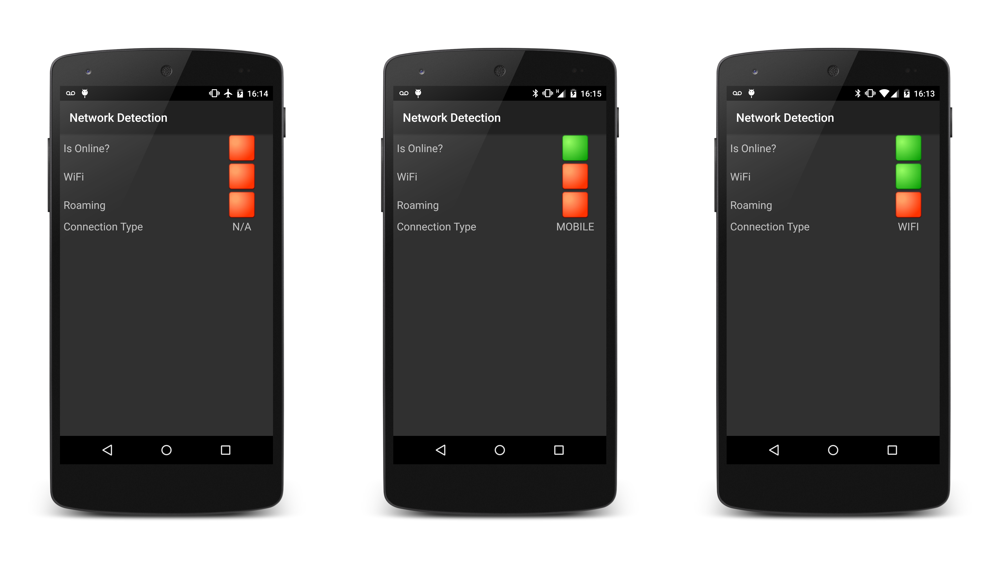

# Recipe

The `Android.Net.ConnectivityManager` class provides information about all the possible network connections for an Android device.
To query the network state, the application must request a `NetworkInfo` object for a type of network. The `NetworkInfo` class which holds information about a given network type. A instance of `NetworkInfo` is obtained by calling the `GetNetworkInfo` member of the `ConnectivityManager` class. This method takes a `ConnectivityType` describing which network to query for more information.

This image shows the sample application for this recipe running while connected to different networks:



> ℹ️ This recipe requires Android 5.0 (API level 21) or higher.

## Using ConnectivityManager

The first thing the sample application must do is obtain a reference to the `ConnectivityManager`:

```csharp
ConnectivityManager connectivityManager = (ConnectivityManager) GetSystemService(ConnectivityService);
```

To query the device for network state, the app must request the `android.permission.ACCESS_NETWORK_STATE` in the manifest:

```xml
<uses-permission android:name="android.permission.ACCESS_NETWORK_STATE"></uses-permission>
```

## Connected to a Network

To check if the device is connected to any type of network the `ActiveNetworkInfo` property of `ConnectivityManager` returns information about the type of network the device is using. The app uses this `NetworkInfo` object to see if the device is connected:

```csharp
NetworkInfo networkInfo = connectivityManager.ActiveNetworkInfo;
bool isOnline = networkInfo.IsConnected;
```

## Connected to WiFi

The property `NetworkInfo.Type` returns a `ConnectivityType` value which can be checked to see if the device is connected to a WiFi network:

```csharp
bool isWifi = networkInfo.Type == ConnectivityType.Wifi;
if(isWifi)
{
    Log.Debug(TAG, "Wifi connected.");
    _wifiImage.SetImageResource(Resource.Drawable.green_square);
} else
{
    Log.Debug(TAG, "Wifi disconnected.");
    _wifiImage.SetImageResource(Resource.Drawable.red_square);
}
```

## Detect When Roaming

The `.IsRoaming` property on the `NetworkInfo` class is a boolean value that is used to determine if they device is roaming while connected to a mobile network. The following code snippet from the sample application will display a green square when the device is roaming, and a red square when it is not:

```csharp
if (networkInfo.IsRoaming)
{
    Log.Debug(TAG, "Roaming.");
    _roamingImage.SetImageResource(Resource.Drawable.green_square);
} else
{
    Log.Debug(TAG, "Not roaming.");
    _roamingImage.SetImageResource(Resource.Drawable.red_square);
}
```
