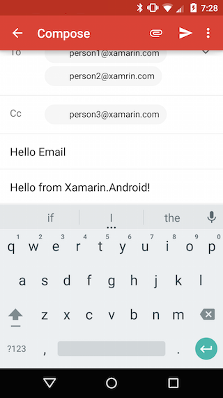

<a name="Recipe" class="injected"></a>


# Recipe

 [ ](Images/SendEmail.png)

Follow these steps to send an email.

-  Create an Intent with an `ActionSend` action.


```
var email = new Intent (Android.Content.Intent.ActionSend);
```

-  Add email extras to the intent’s payload.


```
email.PutExtra (Android.Content.Intent.ExtraEmail,
new string[]{"person1@xamarin.com", "person2@xamrin.com"} );

email.PutExtra (Android.Content.Intent.ExtraCc,
new string[]{"person3@xamarin.com"} );

email.PutExtra (Android.Content.Intent.ExtraSubject, "Hello Email");

email.PutExtra (Android.Content.Intent.ExtraText,
"Hello from Xamarin.Android");
```

-  Set the intent’s mime type to `message/rfc822`.


```
email.SetType ("message/rfc822");
```

-  Start the Activity with the intent;


```
StartActivity (email);
```

 <a name="Additional_Information" class="injected"></a>


# Additional Information

Setting the intent’s mime type to `message/rfc822` causes the mail
application to launch. If multiple applications are capable of handling mail,
the user will get a list to choose from.

