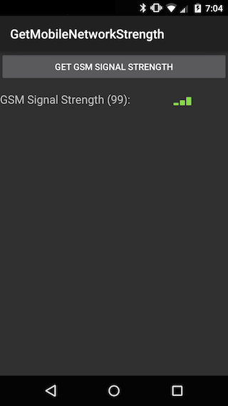
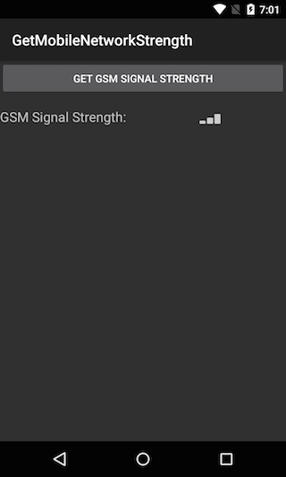

<a name="Recipe" class="injected"></a>

# Recipe

This recipe will show one way to check the strength of the GSM signal received by the phone. The following screenshot shows a sample application that will listen for the GSM signal strength and display it in an activity:

 

Android provides the `PhoneStateListener` class that will monitor changes in the telephone on the device. This class contains various callback methods that the `TelephonyManager` will invoke, depending on changes that occur. An instance (or subclass) of `PhoneStateListener` is passed to the `TelephoneManager.Listen()` method along with some bit-wise flags that define what changes the `PhoneStateListener` is interested in.

To determine the GSM signal strength, it is necessary to subclass `PhoneStateListener` and override the `OnSignalStrengthsChanged` callback. This method is invoked whenever the network signal strength changes.

The following code snippet is one possible implementation of a `PhoneStateListener`:

```
public class GsmSignalStrengthListener : PhoneStateListener
{
	public delegate void SignalStrengthChangedDelegate(int strength);

	public event SignalStrengthChangedDelegate SignalStrengthChanged;

	public override void OnSignalStrengthsChanged(SignalStrength newSignalStrength)
	{
		if (newSignalStrength.IsGsm)
		{
			if (SignalStrengthChanged != null)
			{
				SignalStrengthChanged(newSignalStrength.GsmSignalStrength);
			}
		}
	}
}
```

In this recipe, the class above is used by an `Activity` which contains a `Button`, a `TextView`, and an `ImageView`. The `Activity` has the following UI:

 

The `TextView` will display the numeric value of the signal strength while the `ImageView` will provide a graphical representation of the signal strength.

The `GsmSignalStrengthListener` subclass will check to see if the new `SignalStrength` is indeed a GSM signal. If it is, the `SignalStrengthChanged` event is raised. Interested consumers of `GsmSignalStrengthListener` may assign a handler to this event to capture the new signal strength.

`SignalStrength.GsmSignalStrength` is a value in the range of 0 to 31 and 99. A value of 99 is used for when the signal is *not known* or *not detectable*. The unit of measure for the GSM signal string is know as the *Arbitrary Strength Unit* ( *ASU*).

The `OnCreate` method of the Activity will obtain a reference to the `TelephonyManager` and instantiate a `GsmSignalStrengthListener` object. The following code shows the `OnCreate` method for the Activity:

```
protected override void OnCreate(Bundle bundle)
{
	base.OnCreate(bundle);
	SetContentView(Resource.Layout.Main);

	// Get a reference to the TelephonyManager and instantiate the GsmSignalStrengthListener.
	// These will be used by the Button's OnClick event handler.
	_telephonyManager = (TelephonyManager)GetSystemService(Context.TelephonyService);
	_signalStrengthListener = new GsmSignalStrengthListener();

	_gmsStrengthTextView = FindViewById<TextView>(Resource.Id.textView1);
	_gmsStrengthImageView = FindViewById<ImageView>(Resource.Id.imageView1);
	_getGsmSignalStrengthButton = FindViewById<Button>(Resource.Id.myButton);

	_getGsmSignalStrengthButton.Click += DisplaySignalStrength;
}
```

When the user clicks the `Button`, the Activity will instruct the `_telephonyManager` to listen for changes in signal strength using the `_signalStrengthListener`, as shown in the following code snippet:

```
void DisplaySignalStrength(object sender, EventArgs e)
{
	_telephonyManager.Listen(_signalStrengthListener, PhoneStateListenerFlags.SignalStrengths);
	_signalStrengthListener.SignalStrengthChanged += HandleSignalStrengthChanged;
}
```

The following method is the event handler that the Activity uses to respond `SignalStrengthChanged` events:

```
void HandleSignalStrengthChanged(int strength)
{
	// We want this to be a one-shot thing when the button is pushed. Make sure to unhook everything
	_signalStrengthListener.SignalStrengthChanged -= HandleSignalStrengthChanged;
	_telephonyManager.Listen(_signalStrengthListener, PhoneStateListenerFlags.None);

	// Update the UI with text and an image.
	_gmsStrengthImageView.SetImageLevel(strength);
	_gmsStrengthTextView.Text = string.Format("GPS Signal Strength ({0}):", strength);
}
```

The `SignalStrengthChanged` event handler displayed above will update the UI with the signal strength that was received as well as de-register the event handler for `_signalStrengthListener.SignalStrengthClosed`. Notice as well the call to `_telephonyManager.Listen` with the `PhoneStateListenerFlags.None`. In addition to de-register the event handler it is necessary to explicitly tell `TelephonyManager` that this application is no longer interested in signal strength changes.

> ℹ️ **Note**: The `PhoneStateListener` also provides the callback method `OnSignalStrengthChanged` which has been deprecated since API level 5 (Android 2.0). This method should be avoided.

 <a name="Summary" class="injected"></a>


# Summary

This recipe covered how to use a subclass of `PhoneStateListener` to determine the strength of the GSM signal received by the device.

