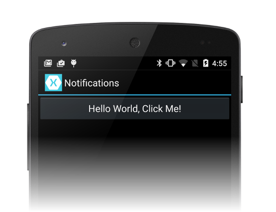
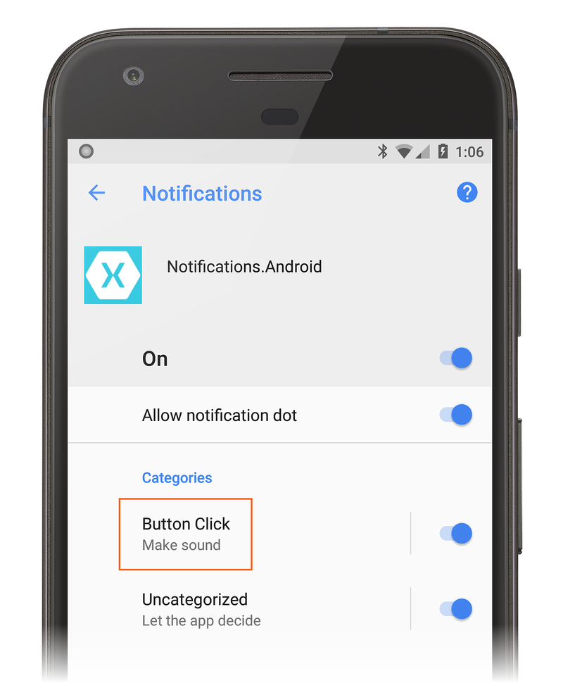

 

 
# Recipe

In this recipe, an existing Xamarin.Android app is converted to use the
new notification channels feature that was introduced in Android Oreo.
The following steps explain how to convert the
[Local Notifications](/samples/monodroid/LocalNotifications/) sample to
use notification channels:

1. Download and open the [Local Notifications](/samples/monodroid/LocalNotifications/)
   sample in Visual Studio. Open the project properties and change the Target Framework
   to **Android 8.0 (Oreo)**:

   

2. Open **MainActivity.cs** and add the following constant string
   definition to the `MainActivity` class. This constant is used as an
   ID string for a notification channel that will be added in a later
   step. This string must be unique within the package so that it is not
   confused with any other notification channels:

        public const string CLICKS_CHANNEL = "com.xamarin.myapp.clicks";

3. Move the code that creates the notification manager so that it is called 
   before `NotificationCompat.Builder` is created:

        NotificationManager notificationManager = 
            (NotificationManager)GetSystemService(Context.NotificationService);

        NotificationCompat.Builder builder = 
            ...

4. After the line that creates `notificationManager`, add the following code to
   create a notification channel. `CLICKS_CHANNEL` specifies the channel ID
   and *Button Click* is the user-visible name of the channel. The channel
   importance is set to `Default` and lock screen visibility is set to
   `Private` (i.e., the notification will not show on the lock screen): 

        var chan = new NotificationChannel(CLICKS_CHANNEL, 
                "Button Click", NotificationImportance.Default);
        chan.LockscreenVisibility = NotificationVisibility.Private;

5. Next, pass the notification channel to the Notification Manager:

        notificationManager.CreateNotificationChannel(chan);

6. Modify the call to the `NotificationCompat.Builder` constructor so
   that the ID of the channel is passed in as the second argument:

        NotificationCompat.Builder builder = 
          new NotificationCompat.Builder(this, CLICKS_CHANNEL)
            .SetAutoCancel(true)
            .SetContentIntent(resultPendingIntent)
                ...

7. Build and run the modified app on an Android 8.0 phone or emulator.
   When you click the button, notifications are now posted locally via
   your "Button Click" notification channel:

   

8. From the **Settings** menu, tap **Apps &amp; Notifications** > 
   **App Info** > **Notifications.Android** > **App Notifications**.
   The *Button Click* notification channel is displayed under
   **Categories**:

   

That's it! 

Try adding a second notification channel by doing the following:

1. Add a second button with the text, **ALERT!**.

2. Write a click event handler for this second button.

2. Define another channel ID (such as `ALERT_CHANNEL`), using a new
   unique text string (such as `com.xamarin.myapp.alerts`).

3. Create a second `NotificationsChannel` object with this ID. Tive
   it the name **Important Alerts** and a notification importance of
   `High`. Set the channel's `LockScreenVisibility` to `Public` so that
   this channel's notifications will appear on the lock screen.

4. Pass this new channel to `NotificationCompat.Builder` and post a
   notification when the **ALERT** button is clicked.

5. Build it and try it out. This second channel will appear under
   app permission **Categories** as **Important Alerts**.

For more information about notification channels in Xamarin.Android, see
[Notification Channels](https://developer.xamarin.com/guides/android/application_fundamentals/notifications/local_notifications_in_android/#Notification_Channels).
   

# Summary

This recipe provided step-by-step instructions for converting existing
local notifications functionality of a Xamarin.Android app to the new
notification channel feature introduced in Android 8.0 Oreo.
