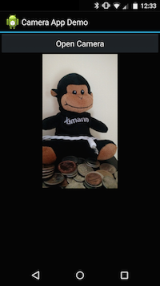
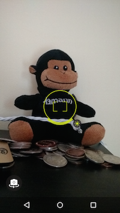

This recipe shows how to launch the built-in camera application to take
a picture, save it to a file, and display it in an ImageView.

<a name="Recipe" class="injected"></a>

# Recipe

[ ](Images/CameraAppDemo1.png) [ ](Images/CameraAppDemo2.png)

-   Create a new Xamarin.Android application named *CameraAppDemo*.

-   Add the `CAMERA` and `WRITE_EXTERNAL_STORAGE` permissions to **AndroidManifest.xml**.

-   Add the following XML to **Main.axml**:

```
<?xml version="1.0" encoding="utf-8"?>
<LinearLayout xmlns:android="http://schemas.android.com/apk/res/android"
    android:orientation="vertical"
    android:layout_width="fill_parent"
    android:layout_height="fill_parent">
    <Button
        android:id="@+id/myButton"
        android:layout_width="fill_parent"
        android:layout_height="wrap_content"
        android:text="@string/openCamera" />
    <ImageView
        android:src="@android:drawable/ic_menu_gallery"
        android:layout_width="fill_parent"
        android:layout_height="300.0dp"
        android:id="@+id/imageView1"
        android:adjustViewBounds="true" />
</LinearLayout>
```

-   Add a string resource named `openCamera` to **Strings.xml**.

```
<string name="openCamera">Open Camera</string>
```

-  In **MainActivity.cs**, declare the following static class with variables:


```
public static class App {
    public static File _file;
    public static File _dir;
    public static Bitmap bitmap;
}
```

-   Next we need to update the `OnCreate` method to match the following
    snippet:

```
protected override void OnCreate (Bundle bundle)
{
    base.OnCreate (bundle);
    SetContentView (Resource.Layout.Main);

    if (IsThereAnAppToTakePictures ())
    {
        CreateDirectoryForPictures ();

        Button button = FindViewById<Button>(Resource.Id.myButton);
        _imageView = FindViewById<ImageView>(Resource.Id.imageView1);
        button.Click += TakeAPicture;
    }
}

```

-   Add the following helper methods to `MainActivity`:

```
private void CreateDirectoryForPictures ()
{
    App._dir = new File (
        Environment.GetExternalStoragePublicDirectory (
            Environment.DirectoryPictures), "CameraAppDemo");
    if (!App._dir.Exists ())
    {
        App._dir.Mkdirs( );
    }
}

private bool IsThereAnAppToTakePictures ()
{
    Intent intent = new Intent (MediaStore.ActionImageCapture);
    IList<ResolveInfo> availableActivities =
        PackageManager.QueryIntentActivities (intent, PackageInfoFlags.MatchDefaultOnly);
    return availableActivities != null && availableActivities.Count > 0;
}

```

-   Next we need to implement the event handler for the `Click` event
    on the button. In this example we will create a method that will
    handle the event:

```
private void TakeAPicture (object sender, EventArgs eventArgs)
{
    Intent intent = new Intent (MediaStore.ActionImageCapture);
    App._file = new File (App._dir, String.Format("myPhoto_{0}.jpg", Guid.NewGuid()));
    intent.PutExtra (MediaStore.ExtraOutput, Uri.FromFile (App._file));
    StartActivityForResult (intent, 0);
}

```

When the user clicks on the button, this application will initiate an
`Intent` asking Android to find an Activity that can take a picture.
Typically this will be an Activity from the built-in Camera
application. Notice that in the `Intent` we provide the location of where
the Camera application should the picture. When the Camera activity
has finished taking the picture, Android will call `OnActivityResult`
in our Activity. Go ahead and implement `OnActivityResult` as shown in
the following snippet of code:


```
protected override void OnActivityResult (int requestCode, Result resultCode, Intent data)
{
    base.OnActivityResult (requestCode, resultCode, data);

    // Make it available in the gallery

    Intent mediaScanIntent = new Intent (Intent.ActionMediaScannerScanFile);
    Uri contentUri = Uri.FromFile (App._file);
    mediaScanIntent.SetData (contentUri);
    SendBroadcast (mediaScanIntent);

    // Display in ImageView. We will resize the bitmap to fit the display.
    // Loading the full sized image will consume to much memory
    // and cause the application to crash.

    int height = Resources.DisplayMetrics.HeightPixels;
    int width = _imageView.Height ;
    App.bitmap = App._file.Path.LoadAndResizeBitmap (width, height);
    if (App.bitmap != null) {
        _imageView.SetImageBitmap (App.bitmap);
        App.bitmap = null;
    }

    // Dispose of the Java side bitmap.
    GC.Collect();
}

```

Notice in the code above that we don't load the file from disk.
Instead, we call a helper method to resize the image for us. Also, we
call `GC.Collect()` to dispose of the Java side bitmap (which is no
longer referenced) - this is necessary to avoid `OutOfMemory`
exceptions. For more information about managing bitmap memory in
Android, see
[Managing Bitmap Memory](https://developer.android.com/training/displaying-bitmaps/manage-memory.html).

-   Finally, we need to create the helper method to resize the picture.
    The following class is one example of how to do so using an
    extension method:

```
public static class BitmapHelpers
{
    public static Bitmap LoadAndResizeBitmap (this string fileName, int width, int height)
    {
        // First we get the the dimensions of the file on disk
        BitmapFactory.Options options = new BitmapFactory.Options { InJustDecodeBounds = true };
        BitmapFactory.DecodeFile (fileName, options);

        // Next we calculate the ratio that we need to resize the image by
        // to fit the requested dimensions.
        int outHeight = options.OutHeight;
        int outWidth = options.OutWidth;
        int inSampleSize = 1;

        if (outHeight > height || outWidth > width)
        {
            inSampleSize = outWidth > outHeight
                               ? outHeight / height
                               : outWidth / width;
        }

        // Now we will load the image and have BitmapFactory resize it for us.
        options.InSampleSize = inSampleSize;
        options.InJustDecodeBounds = false;
        Bitmap resizedBitmap = BitmapFactory.DecodeFile (fileName, options);

        return resizedBitmap;
    }
}
```

<a name="Additional_Information" class="injected"></a>

# Additional Information

The code uses an intent with the `ActionImageCapture` action to launch
the camera application. The code uses the `PackageManager` to check that
the camera is available. Then it creates a directory to save the photo
in. By creating a file and adding its Uri to the intent, the camera
application will save the resulting photo in this file. In the
`OnActivityResult` method, we make the photo available in the device
image gallery, and also add the image to an `ImageView` for display
(after resizing the image to conserve memory).

