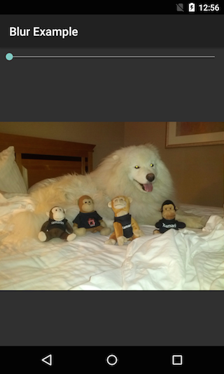

This recipe shows one way to blur an image using an API that was introduced in Android 4.2.2 (API level 17) - `Android.Renderscripts.ScriptIntrinsicBlur`. This class will apply a [Gaussian blur](http://en.wikipedia.org/wiki/Gaussian_blur). `ScriptIntrinsicBlur` is a pre-implemented graphics
    filter that runs at the native level for maximum performance. Because this class uses [Renderscript](http://developer.android.com/guide/topics/renderscript/compute.html), it can spread out the
    workload over all the CPU cores on the device for maximum performance.

The recipe [Blur an Image with Managed Code]() is a example of how to apply a blur effect on all Android API levels.

This application will display a picture and a [SeekBar](http://developer.android.com/reference/android/widget/SeekBar.html).
    The value of the **SeekBar** will determine how much the image should be blurred. You can see
    this application running in the following screenshots:

  

 <a name="Requirements" class="injected"></a>


# Requirements

This recipe will only work with Android 4.2.2 (API level 17) or higher.

 <a name="Recipe" class="injected"></a>


# Recipe


The UI for this recipe is contained in the following XML layout file:

```
<?xml version="1.0" encoding="utf-8"?>
    <LinearLayout xmlns:android="http://schemas.android.com/apk/res/android"
                  android:orientation="vertical"
                  android:layout_width="fill_parent"
                  android:layout_height="fill_parent">
        <SeekBar
                android:layout_width="fill_parent"
                android:layout_height="wrap_content"
                android:id="@+id/seekBar1"
                android:max="25" />
        <ImageView
                android:src="@drawable/dog_and_monkeys"
                android:layout_width="fill_parent"
                android:layout_height="fill_parent"
                android:id="@+id/originalImageView" />
    </LinearLayout>
```

This is a very simple UI that has an `ImageView` and a `SeekBar`. We inflate this layout and
wire up an event handler to the `SeekBar` in `OnCreate` method of our activity, as shown in the
following code:

```
protected override void OnCreate (Bundle bundle)
{
    base.OnCreate (bundle);

    SetContentView (Resource.Layout.Main);
    _imageView = FindViewById<ImageView> (Resource.Id.originalImageView);

    _seekbar = FindViewById<SeekBar> (Resource.Id.seekBar1);
    _seekbar.StopTrackingTouch += BlurImageHandler;
}
```

When the user stops sliding their finger along the `SeekBar`, the `StopTrackingTouch` event
will be fired and the `BlurImageHandler` method invoked. The contents of this handler maybe seen in the
following snippet:

```
private void BlurImageHandler (object sender, SeekBar.StopTrackingTouchEventArgs e)
{
    int radius = e.SeekBar.Progress;
    if (radius == 0) {
        // We don't want to blur, so just load the un-altered image.
        _imageView.SetImageResource (Resource.Drawable.dog_and_monkeys);
    } else {
        DisplayBlurredImage (radius);
    }
}
```

If the `SeekBar` has a value greater than zero, then we will need to apply a blur filter. If the value
of the `SeekBar` is zero, then no blur needs to be applied. The code inside `DisplayBlurredImage` can be seen below:

```
private void DisplayBlurredImage (int radius)
{
    _seekbar.StopTrackingTouch -= BlurImageHandler;
    _seekbar.Enabled = false;

    ShowIndeterminateProgressDialog ();

    Task.Factory.StartNew (() => {
        Bitmap bmp = CreateBlurredImage (radius);
        return bmp;
    })
    .ContinueWith (task => {
        Bitmap bmp = task.Result;
        _imageView.SetImageBitmap (bmp);
        _seekbar.StopTrackingTouch += BlurImageHandler;
        _seekbar.Enabled = true;
        DismissIndeterminateProgressDialog ();
    }, TaskScheduler.FromCurrentSynchronizationContext ());
}
```

Let's take a quick moment to understand `DisplayBlurredImage`. The first thing we do is to disable
the `SeekBar` and display an indeterminate progress dialog. To keep our application responsive and to
prevent an ANR (Application Not Responding) message from Android, the actual filtering will be performed in a separate
thread. This example will invoke the method `CreateBlurredImage` via the Task Parallel Library. The `Task`
that we created to do this work has a continuation that will update the UI with the blurred image and dismiss the
progress dialog. This continuation is scheduled to run in the UI thread of our application.

The final piece of code we need to examine will perform the actual blurring of the image.  The code for this is contained
in the method `CreateBlurredImage`. This code has comments inline to help explain the relevant parts of code:

```
private Bitmap CreateBlurredImage (int radius)
{
    // Load a clean bitmap and work from that.
    Bitmap originalBitmap = BitmapFactory.DecodeResource (Resources, Resource.Drawable.dog_and_monkeys);

    // Create another bitmap that will hold the results of the filter.
    Bitmap blurredBitmap;
    blurredBitmap = Bitmap.CreateBitmap (originalBitmap);

    // Create the Renderscript instance that will do the work.
    RenderScript rs = RenderScript.Create (this);

    // Allocate memory for Renderscript to work with
    Allocation input = Allocation.CreateFromBitmap (rs, originalBitmap, Allocation.MipmapControl.MipmapFull, AllocationUsage.Script);
    Allocation output = Allocation.CreateTyped (rs, input.Type);

    // Load up an instance of the specific script that we want to use.
    ScriptIntrinsicBlur script = ScriptIntrinsicBlur.Create (rs, Element.U8_4 (rs));
    script.SetInput (input);

    // Set the blur radius
    script.SetRadius (radius);

    // Start the ScriptIntrinisicBlur
    script.ForEach (output);

    // Copy the output to the blurred bitmap
    output.CopyTo (blurredBitmap);

    return blurredBitmap;
}
```


 <a name="Summary" class="injected"></a>


# Summary

This recipe showed one way to apply a Gaussian blur to an image using `Android.Renderscripts.ScriptIntrinsicBlur`.
To keep the UI responsive, the filter was applied in a background thread using the Task Parallel Library.

