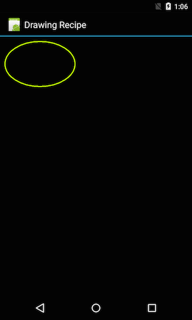

This recipe will provide an example of drawing a simple 2-D object.

 [ ](Images/oval.png)

 **Related Google Documentation:**

 <a name="Recipe" class="injected"></a>


# Recipe

1.  Create a new Xamarin.Android application named  `TwoDDrawing` . Notice that the project name does not start with a number.
2.  Delete  `Main.axml` , it is not necessary for this recipe.
3.  Create a new class in the project named  `MyOvalShape` , have it extend  `Android.Views.View` , and implement a constructor that takes a  `Android.Content.Context` :


```
public class MyOvalShape : View
{
    public MyOvalShape(Context context) : base(context) { }
}
```

<ol start="4">
  <li>Add an instance variable to the class:</li>
</ol>

```
private readonly ShapeDrawable _shape;
```

<ol start="5">
  <li>Add the following code into the constructor of <code>MyOvalShape</code> to create the shape that is to be drawn:</li>
</ol>

```
public MyOvalShape(Context context) : base(context)
{
    var paint = new Paint();
    paint.SetARGB(255, 200, 255, 0);
    paint.SetStyle(Paint.Style.Stroke);
    paint.StrokeWidth = 4;

    _shape = new ShapeDrawable(new OvalShape());
    _shape.Paint.Set(paint);

    _shape.SetBounds(20, 20, 300, 200);
}
```

<ol start="6">
  <li>Override <code>OnDraw</code> inside <code>MyOvalShape</code>, this will draw the oval:</li>
</ol>

```
protected override void OnDraw(Canvas canvas)
{
    _shape.Draw(canvas);
}
```

<ol start="7">
  <li>Modify <code>Activity1.OnCreate</code> so that the oval will be drawn when the application starts:</li>
</ol>

```
protected override void OnCreate(Bundle bundle)
{
    base.OnCreate(bundle);
    SetContentView(new MyOvalShape(this));
}
```

<ol start="8">
  <li>Run the application on a device, and an oval shape will be drawn:</li>
</ol>

 [ ](Images/oval.png)

 <a name="Additional_Information" class="injected"></a>


## Additional Information

 []()

 `ShapeDrawable` is an extension of the `Drawable` class
which defines some basic geometric shapes such as arcs, ovals, and
rectangles.

