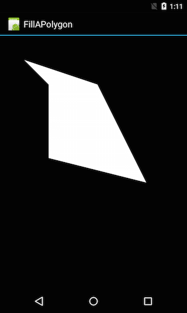

<a name="Recipe" class="injected"></a>


# Recipe

The [Canvas](http://developer.android.com/reference/android/graphics/Canvas.html) class in Android can be used to perform specialized drawing
of graphics. A canvas provides a context that holds the various “drawing”
calls. To draw on a Canvas, three things are required:

-  A  [Paint](http://developer.android.com/reference/android/graphics/Paint.html) object that describes the colors and styles being drawn
-  A drawing primitive such as a  [Rect](http://developer.android.com/reference/android/graphics/Rect.html) ,  [Path](http://developer.android.com/reference/android/graphics/Path.html) , or a  [Bitmap](http://developer.android.com/reference/android/graphics/Bitmap.html) to that describes what is being drawn.
-  A bitmap or a view to hold the pixels that will be drawn.


The following class provides an example of how to draw a polygon and fill it.
A Path object is instantiated. The Path is initiated with a call to `.MoveTo`–
this sets the starting location of the Path. Then corresponding calls to the
`.LineTo` method are made.

For example, consider the following collection of points:

```
private readonly PointF[] _points = new[]
                                        {
                                            new PointF(100, 100),
                                            new PointF(200, 200),
                                            new PointF(200, 500),
                                            new PointF(600, 600),
                                            new PointF(400, 200),
                                            new PointF(100, 100)
                                        };
```

The example assembles a Path object that holds the primitives that make up
the polygon, as shown in the following snippet:

```
var path = new Path();
// Set the first point, that the drawing will start from.
path.MoveTo(_points[0].X, _points[0].Y);
for (var i = 1; i < _points.Length; i++)
{
    // Draw a line from the previous point in the path to the new point.
    path.LineTo(_points[i].X, _points[i].Y);
}
```

The next step is to describe the paint for the polygon:

```
var paint = new Paint
{
    Color = Color.White
};
// We can use Paint.Style.Stroke if we want to draw a "hollow" polygon,
// But then we had better set the .StrokeWidth property on the paint.
paint.SetStyle(Paint.Style.Fill);
```

Finally, the path and the paint are used in together to draw the polygon on a
Canvas:

```
canvas.DrawPath(path, paint);
```

For this example, the above snippets have been encapsulate in a class called
`FilledPolygon`, which is a subclass of a `View`:

```
public class FilledPolygon : View
{
    private readonly PointF[] _points = new[]
                                            {
                                                new PointF(100, 100),
                                                new PointF(200, 200),
                                                new PointF(200, 500),
                                                new PointF(600, 600),
                                                new PointF(400, 200),
                                                new PointF(100, 100)
                                            };
   public FilledPolygon(Context context)
        : base(context)
    {
    }
    protected override void OnDraw(Canvas canvas)
    {
        base.OnDraw(canvas);
        var path = new Path();
        path.MoveTo(_points[0].X, _points[0].Y);
        for (var i = 1; i < _points.Length; i++)
        {
            path.LineTo(_points[i].X, _points[i].Y);
        }
        var paint = new Paint
                        {
                            Color = Color.White
                        };
        // We can use Paint.Style.Stroke if we want to draw a "hollow" polygon,
        // But then we had better set the .StrokeWidth property on the paint.
        paint.SetStyle(Paint.Style.Fill);
                 canvas.DrawPath(path, paint);
    }
}
```

In this case, when the view is render, the `OnDraw` method will be invoked, and
the hosting activity will pass in a canvas instance.

When the application is run it will look like:

 [ ](Images/image1.png)

