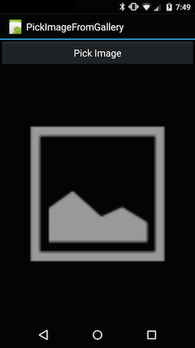
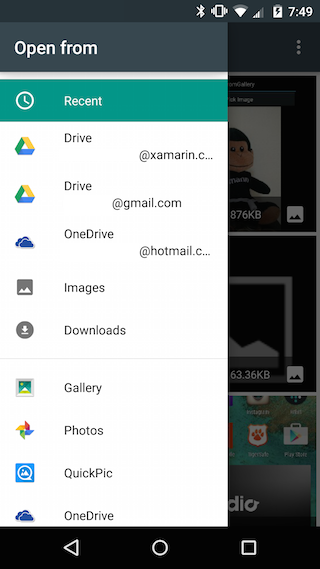
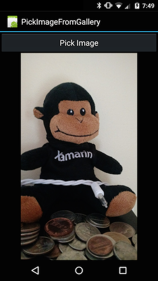

This recipe will show how to pick a image stored on the device, display it in an `ImageView` and obtain the path the file on the device. This recipe accomplishes this by firing off an `Intent` to start an application (of the users choice) to select the image. The selection will be sent back to our application via a URI that is wrapped in an Intent. The following screenshots shows the sample application included with this recipe.

  

  

 <a name="Recipe" class="injected"></a>


# Recipe

<ol>
    <li>Create a new Android Application in Visual Studio for Mac or Visual Studio.</li>
    <li>Add a Button and an <code>ImageView</code> to Main.axml, as shown in the following XML:</li>
</ol>
```
&lt;?xml version="1.0" encoding="utf-8"?&gt;
&lt;LinearLayout xmlns:android="http://schemas.android.com/apk/res/android"
              android:orientation="vertical"
              android:layout_width="fill_parent"
              android:layout_height="fill_parent"&gt;
    &lt;Button
            android:id="@+id/MyButton"
            android:layout_width="fill_parent"
            android:layout_height="wrap_content"
            android:text="Pick Image" /&gt;
    &lt;ImageView
            android:src="@android:drawable/ic_menu_gallery"
            android:layout_width="fill_parent"
            android:layout_height="fill_parent"
            android:id="@+id/imageView1" /&gt;
&lt;/LinearLayout&gt;
```
<ol start="3">
    <li>Add the following instance variables to <code>Activity</code>:</li>
</ol>

```
[Activity(Label = "PickImageFromGallery", MainLauncher = true, Icon = "@drawable/icon")]
public class Activity1 : Activity
{
    public static readonly int PickImageId = 1000;
    private ImageView _imageView;
```

<ol start="4">
    <li>Change the code in <code>OnCreate</code> as shown in the following snippet:</li>
</ol>

```
protected override void OnCreate(Bundle bundle)
{
    base.OnCreate(bundle);

    SetContentView(Resource.Layout.Main);
    _imageView = FindViewById&lt;ImageView&gt;(Resource.Id.imageView1);
    Button button = FindViewById&lt;Button&gt;(Resource.Id.MyButton);
    button.Click += ButtonOnClick;
}
```

<ol start="5">
    <li>Create the <code>ButtonOnClick</code> event handler with the following method:</li>
</ol>

```
private void ButtonOnClick(object sender, EventArgs eventArgs)
{
    Intent = new Intent();
    Intent.SetType("image/*");
    Intent.SetAction(Intent.ActionGetContent);
    StartActivityForResult(Intent.CreateChooser(Intent, "Select Picture"), PickImageId);
}
```
This event handler will fire off an `Intent` to Android. The intent specifies two things:
- **An Action** - The code above sets the action to `Intent.ActionGetCode`. This is the default action.
- **Content Type** - this is set to the MIME type for all images.

The helper method `Intent.CreateChooser` will present a dialog to the user with a list of all applications
that can handle the intent, as shown in this screenshot:


Once the user selects their image, `Intent.CreateChooser` will create an Intent
that will be used by `StartActivityForResult` to start the application to handle
the request. When that application is finished, Android will invoke the
`OnActivityResult` method in our application.

<ol start="6">
  <li>To handle the request for the image picking application, we need to override the method
  <code>OnActivityResult</code>  with the following code:</li>
</ol>

```
protected override void OnActivityResult(int requestCode, Result resultCode, Intent data)
{
    if ((requestCode == PickImageId) && (resultCode == Result.Ok) && (data != null))
    {
        Uri uri = data.Data;
        _imageView.SetImageURI(uri);
    }
}
```
In this method we ensure that we only respond to the request that our Activity originally sent out in the the `ButtonOnClick` event handler. We will obtain the `Uri` of the selected image and display that image in the `ImageView`.

<ol start="7">
    <li>Run the application, and you should get screens similar to the following:</li>
</ol>


