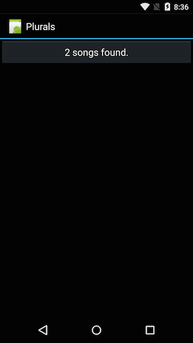

<a name="Recipe" class="injected"></a>


# Recipe

-  Create a new Xamarin.Android project called Plurals.
-  Modify **Main.axml**


```
<?xml version="1.0" encoding="utf-8"?>
<LinearLayout xmlns:android="http://schemas.android.com/apk/res/android"
    android:orientation="vertical"
    android:layout_width="fill_parent"
    android:layout_height="fill_parent"
    >
  <Button
      android:id="@+id/MyButton"
      android:layout_width="fill_parent"
      android:layout_height="wrap_content"
      android:text="Hello"
    />
</LinearLayout>
```

-  Edit the file **Resource/Strings/values.xml**:


```
<?xml version="1.0" encoding="utf-8"?>
<resources>
  <plurals name="numberOfSongsAvailable">
    <item quantity="one">One song found.</item>
    <item quantity="other">%d songs found.</item>
  </plurals>
</resources>
```

-  Modify the `OnCreate` method **Activity1.cs**:


```
protected override void OnCreate(Bundle bundle)
{
    base.OnCreate(bundle);
    SetContentView(Resource.Layout.Main);

    var button = FindViewById<Button>(Resource.Id.MyButton);
    button.Click += delegate
                       {
                           count++;
                            var buttonText = Resources.GetQuantityString(Resource.Plurals.numberOfSongsAvailable, count, count);
                            button.Text = buttonText;
                        };
}
```

Because the strings for quantities have formatting elements in them, we need
to pass the value of count in twice. The first parameter is what Android will
use to select the correct quantity string. The second value of count is the
actual value that will be provided.

-  Run the application:

[ ](Images/EN_us_one.png) [ ](Images/EN_us_two.png)

-  Add a new resource file for Polish, **Layout/values-pl/strings.xml**:


```
<?xml version="1.0" encoding="utf-8"?>
<resources>
  <plurals name="numberOfSongsAvailable">
    <item quantity="one">Znaleziono jedną piosenkę.</item>
    <item quantity="few">Znaleziono %d piosenki.</item>
    <item quantity="other">Znaleziono %d piosenek.</item>
  </plurals>
</resources>
```

-  Change the locale to Polish (Polski) (Settings &gt; Language &amp; Input).
-  Run the application:


[ ](Images/PL_one.png) [ ](Images/PL_two.png)

