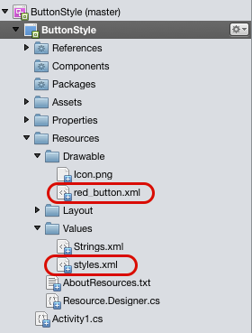
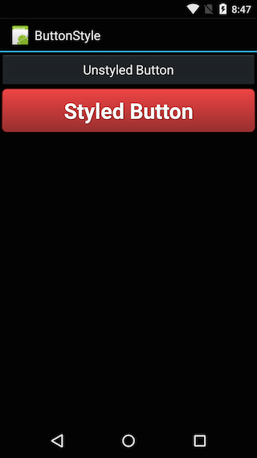

<a name="Recipe" class="injected"></a>


# Recipe

1. Create a new Xamarin.Android application named
StyleAButton.

2. Edit MainActivity.cs:

```
[Activity(Label = "ButtonStyle", MainLauncher = true, Icon = "@drawable/icon")]
public class Activity1 : Activity
{
    protected override void OnCreate(Bundle bundle)
    {
        base.OnCreate(bundle);
        SetContentView(Resource.Layout.Main);
    }
}
```

<ol start="3">
  <li>Alter Main.axml:</li>
</ol>

```
<?xml version="1.0" encoding="utf-8"?>
<LinearLayout xmlns:android="http://schemas.android.com/apk/res/android"
    android:orientation="vertical"
    android:layout_width="fill_parent"
    android:layout_height="fill_parent">
    <Button
        android:text="Unstyled Button"
        android:layout_width="fill_parent"
        android:layout_height="wrap_content"
        android:id="@+id/button2" />
    <Button
        android:background="@drawable/red_button"
        android:id="@+id/button1"
        android:layout_width="fill_parent"
        android:layout_height="wrap_content"
        android:text="Styled Button"
        style="@style/button_text" />
</LinearLayout>
```

<ol start="4">
  <li>Add a new resource to the Drawable folder as an XML file called red_button.xml:</li>
</ol>

```
<?xml version="1.0" encoding="utf-8" ?>
<selector xmlns:android="http://schemas.android.com/apk/res/android">
  <item android:state_pressed="true" >
    <shape>
      <solid
          android:color="#ef4444" />
      <stroke
          android:width="1dp"
          android:color="#992f2f" />
      <corners
          android:radius="6dp" />
      <padding
          android:left="10dp"
          android:top="10dp"
          android:right="10dp"
          android:bottom="10dp" />
    </shape>
  </item>
  <item>
    <shape>
      <gradient
          android:startColor="#ef4444"
          android:endColor="#992f2f"
          android:angle="270" />
      <stroke
          android:width="1dp"
          android:color="#992f2f" />
      <corners
          android:radius="6dp" />
      <padding
          android:left="10dp"
          android:top="10dp"
          android:right="10dp"
          android:bottom="10dp" />
    </shape>
  </item>
</selector>
```

<ol start="5">
  <li>Create a new resource in the Values directory called styles.xml:</li>
</ol>

```
<?xml version="1.0" encoding="utf-8" ?>
<resources>
  <style name="button_text" >
    <item name="android:layout_width" >fill_parent</item>
    <item name="android:layout_height" >wrap_content</item>
    <item name="android:textColor" >#ffffff</item>
    <item name="android:gravity" >center</item>
    <item name="android:layout_margin" >3dp</item>
    <item name="android:textSize" >30dp</item>
    <item name="android:textStyle" >bold</item>
    <item name="android:shadowColor" >#000000</item>
    <item name="android:shadowDx" >1</item>
    <item name="android:shadowDy" >1</item>
    <item name="android:shadowRadius" >2</item>
  </style>
</resources>
```

<ol start="6">
  <li>At this point the project should have two new XML files created, one in the Drawable folder, and another in the Values folder:</li>
</ol>

 

<ol start="7">
  <li>Run the application on a device, and two buttons should appear. One appears as the default system button, while the other is a red button with rounded corners and large white text:</li>
</ol>

 [ ](Images/style_buttons.png)

When the styled button is pressed, it will change color slightly from a
darker red to a bright red:

 [ ](Images/style_buttons.png)

 <a name="Additional_Information" class="injected"></a>


# Additional Information

This example created a style called `button_text` to specify the look and format
of the button. A style is a collection of properties that specify the look and
format for a View or window. A style can specify properties such as height,
padding, font color, font size, background color, and much more. A style is
defined in an XML resource that is separate from the XML that specifies the
layout.

To change the appearance of the button it was necessary to create a
custom shape drawable, and then assign that to the background attribute of the
Button.

