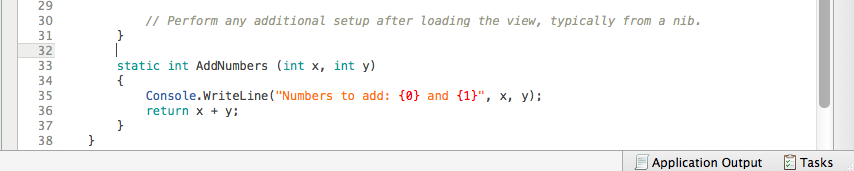
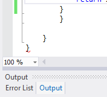
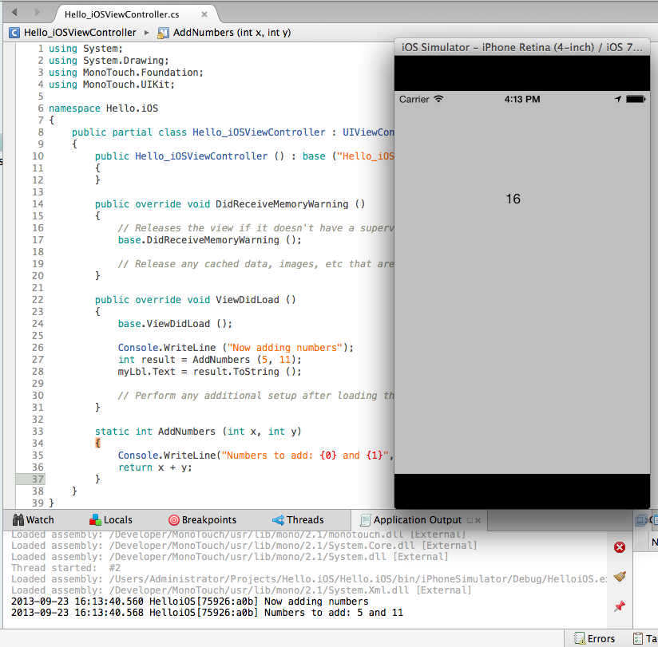
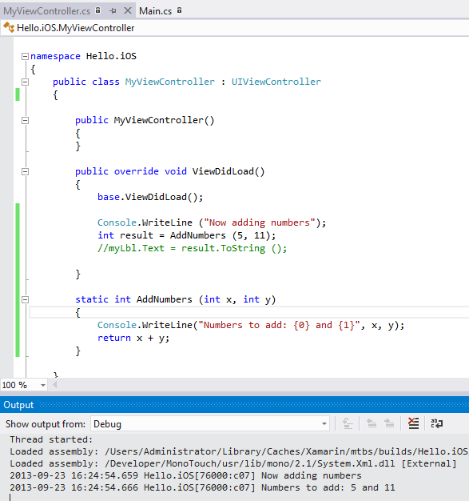

# Recipe

The log window is a useful debugging tool, and is simple to use.

1. First, locate the log window. You can toggle it in Visual Studio for Mac by selecting
the **Application Output** panel on the bottom right:

 

In Visual Studio, select the **Output** panel on the bottom left:

 

<ol start="2">
  <li>Choose a point in your code where you would like to output information to the log window:</li>
</ol>

 

<ol start="3">
  <li>Get the console to give you some helpful feedback about what is going on in your code. For example, you can have it output a message when a particular event occurs:</li>
</ol>

 

 

