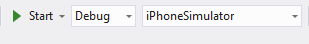
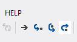
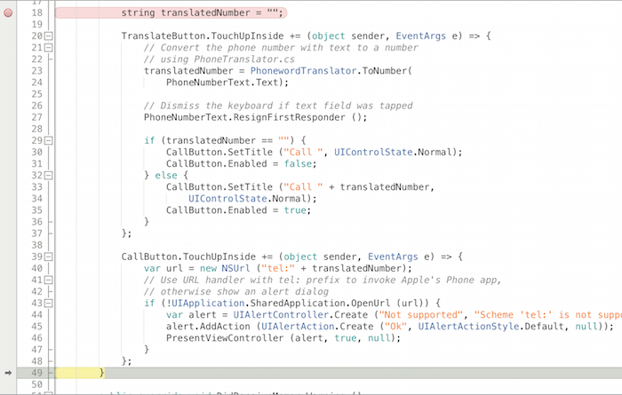
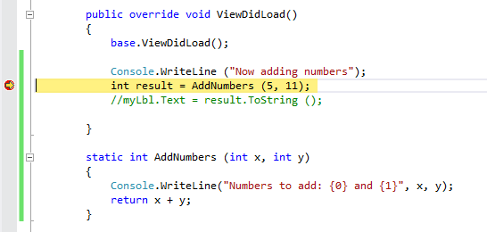

# Recipe

1. Put your IDE into Debug mode, and set a breakpoint at the point in the
code where you want to start stepping from:

 

2. On the top left, you will see four gray icons with arrows and dots:

 

In Visual Studio, the controls look the same except the arrows are blue:

 

 

You have four options here:

-  **Play** will begin running the code.
-  **Step over** and  **Step into** execute the next line of code. If the next line of code is a function call,  **Step over** will execute the entire function and stop at the next line of code outside it.  **Step into** will stop at the first line of code inside the function.
-  Use  **Step out** if you are inside a function, and want to move on to the next function.

3. The following screenshot illustrates stopping at the first breakpoint, and stepping into the next function:

 

 

