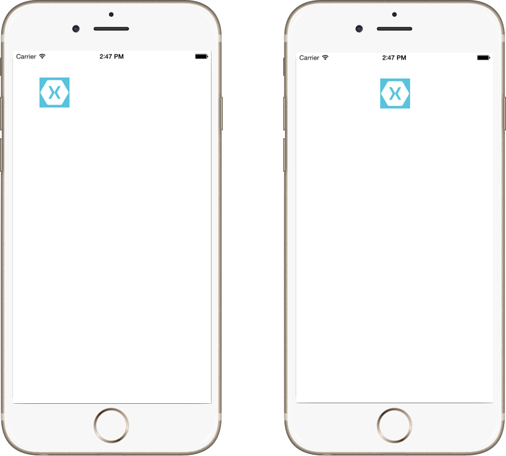

<a name="Recipe" class="injected"></a>


# Recipe

 [ ](Images/Group.png)

 Follow these steps to create the animation:

-  Add an image named `Icon.png` to the project with a [*Build Action*](http://developer.xamarin.com/guides/ios/application_fundamentals/working_with_images/) of **Content**.
-  Add the following using directives:

```
using CoreGraphics;
```

-  In a UIViewController subclass create class variables for a UIImageView, UIImage and point.


```
CGPoint pt;
UIImage image;
UIImageView imageView;
```

-  In the `ViewDidLoad` method, create the UIImageView, assign it a UIImage and add it as a subview.


```
imageView = new UIImageView(new CGRect (50, 50, 57, 57));
image = UIImage.FromFile("Icon.png");
imageView.Image = image;
View.AddSubview(imageView);
```

-  Set the point to the Center property of the UIImageView.


```
pt = imageView.Center;
```

-  Call `UIView.Animate` and pass the *duration*, *delay*, *animation options*, and lambda expressions for the *animation* code and *animation completion* code.


```
UIView.Animate (2, 0, UIViewAnimationOptions.CurveEaseInOut | UIViewAnimationOptions.Autoreverse,
				() => {
					imageView.Center =
						new CGPoint (UIScreen.MainScreen.Bounds.Right - imageView.Frame.Width / 2, imageView.Center.Y);},
				() => {
					imageView.Center = pt; }
			);
```

 <a name="Additional_Information" class="injected"></a>


# Additional Information

Objective-C blocks are bound to `NSAction` delegates in C#. Therefore, lambda
expressions can be used to define the code that will be called for the animation
as well as the animation completion callback.

