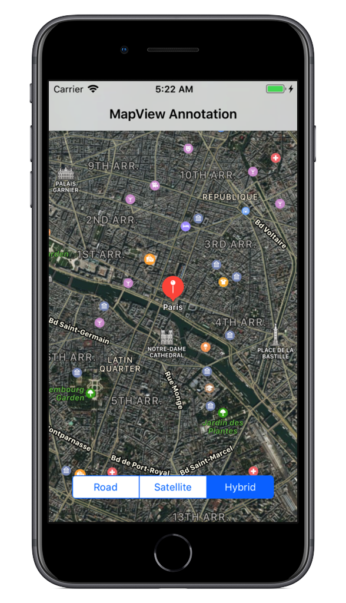

<a name="Recipe" class="injected"></a>


# Recipe

A basic annotation consists of a pin marker added to map. When touched, the
pin displays a small popup with more information. To add an annotation to a
MKMapView:

1. Start with an existing MKMapView or review the  [Displaying a Location (MapView)](https://developer.xamarin.com/Recipes/ios/content_controls/map_view/display_a_location) recipe.

<ol start="2">
	<li>Create a subclass of MKAnnotation</li>
</ol>


```
class BasicMapAnnotation : MKAnnotation
{
        CLLocationCoordinate2D coord;
        string title, subtitle;

        public override CLLocationCoordinate2D Coordinate { get{ return coord; }}
        public override void SetCoordinate(CLLocationCoordinate2D value) 
	{
            coord = value;
        }
        public override string Title { get{ return title; }}
        public override string Subtitle { get{ return subtitle; }}
        public BasicMapAnnotation (CLLocationCoordinate2D coordinate, string title, string subtitle) 
	{
            this.coord = coordinate;
            this.title = title;
            this.subtitle = subtitle;
        }
}
```

<ol start="3">
	<li>Create the annotation and add it to the map: </li>
</ol>


```
var annotation = new BasicMapAnnotation (new CLLocationCoordinate2D(48.857,2.351), "Paris", "City of Light");
mapView.AddAnnotation(annotation);
```

<ol start="4">
	<li>Finally, ensure the map is centered to show the annotation:</li>
</ol>


```
var coords = new CLLocationCoordinate2D(48.857,2.351);
var span = new MKCoordinateSpan(MilesToLatitudeDegrees(2), MilesToLongitudeDegress(2, coords.Latitude));
mapView.Region = new MKCoordinateRegion(coords, span);
```

 

 <a name="Additional_Information" class="injected"></a>


# Additional Information

The MilesToLatitudeDegrees and MilesToLongitudeDegrees helper methods can be
found in the [Displaying a Location](/Recipes/ios/content_controls/map_view/display_device_location) recipe.

