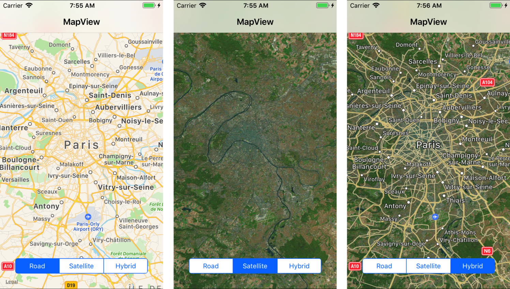

<a name="Recipe" class="injected"></a>


# Recipe

To change the mode of a MKMapView:

1.  Start with an existing MKMapView or review the  [Displaying a Location](/Recipes/ios/content_controls/map_view/display_device_location) recipe.
1.  Change the map type in code using one of these statements:


```
mapView.MapType = MKMapType.Standard; // the default, road map
mapView.MapType = MKMapType.Satellite;
mapView.MapType = MKMapType.Hybrid;
```

 [ ](Images/MapView_Types.png)

<ol start="3">
	<li>To add a segment control to allow the user to switch between modes, add the following code: </li>
</ol>


```
int typesWidth=260, typesHeight=30, distanceFromBottom=60;
mapTypes = new UISegmentedControl(new CGRect((View.Bounds.Width-typesWidth)/2, View.Bounds.Height-distanceFromBottom, typesWidth, typesHeight));
mapTypes.BackgroundColor = UIColor.White;
mapTypes.Layer.CornerRadius = 5;
mapTypes.ClipsToBounds = true;
mapTypes.InsertSegment("Road", 0, false);
mapTypes.InsertSegment("Satellite", 1, false);
mapTypes.InsertSegment("Hybrid", 2, false);
mapTypes.SelectedSegment = 0; // Road is the default
mapTypes.AutoresizingMask = UIViewAutoresizing.FlexibleTopMargin;
mapTypes.ValueChanged += (s, e) => {
    switch(mapTypes.SelectedSegment) {
    case 0:
        mapView.MapType = MKMapType.Standard;
        break;
    case 1:
        mapView.MapType = MKMapType.Satellite;
        break;
    case 2:
        mapView.MapType = MKMapType.Hybrid;
        break;
    }
};
```

 [ ](Images/MapView_TypesA.png)

