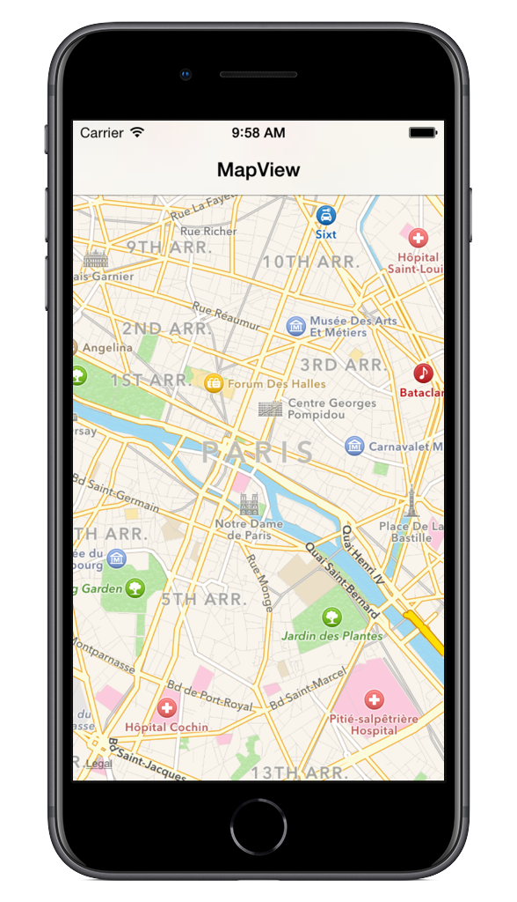

<a name="Recipe" class="injected"></a>


# Recipe

To show a location on a map in a <span class="s2">MKMapView</span>:

<ol start="1">
	<li>Create a <span class="s2">MKMapView</span> and add it to a view.
Setting the AutoresizingMask ensures the control fits nicely in the screen
(adjusting for the navigation bar that is added in the sample):</li>
</ol>
```
mapView = new MKMapView (View.Bounds);
mapView.AutoresizingMask = UIViewAutoresizing.FlexibleDimensions;
View.AddSubview(mapView);
```

<ol start="2">
	<li>Add these helper methods to calculate the area to show on the
map:</li>
</ol>


```
public double MilesToLatitudeDegrees(double miles)
{
   double earthRadius = 3960.0; // in miles
   double radiansToDegrees = 180.0/Math.PI;
   return (miles/earthRadius) * radiansToDegrees;
}
```

```
public double MilesToLongitudeDegrees(double miles, double atLatitude)
{
   double earthRadius = 3960.0; // in miles
   double degreesToRadians = Math.PI/180.0;
   double radiansToDegrees = 180.0/Math.PI;
   // derive the earth's radius at that point in latitude
   double radiusAtLatitude = earthRadius * Math.Cos(atLatitude * degreesToRadians);
   return (miles / radiusAtLatitude) * radiansToDegrees;
}
```

<ol start="3">
	<li>Create a location coordinate (for example, the latitude &amp;
longitude of Paris):</li>
</ol>

```
CLLocationCoordinate2D coords = new CLLocationCoordinate2D(48.857, 2.351);
```

<ol start="4">
	<li>Determine the area to display (20 miles in this example):</li>
</ol>

```
MKCoordinateSpan span = new MKCoordinateSpan(MilesToLatitudeDegrees(20), MilesToLongitudeDegrees(20, coords.Latitude));
```

<ol start="5">
	<li>Set the <span class="s2">Region</span> property on the map:</li>
</ol>

```
mapView.Region = new MKCoordinateRegion(coords, span);
```

<ol start="6">
	<li>The map will now show, centered on Paris, France with the default map
type (which is the street map).</li>
</ol>

 

 <a name="Additional_Information" class="injected"></a>


# Additional Information

If you prefer to work in kilometres, it is trivial to convert the helper
functions:

```
/// <summary>Converts kilometres to latitude degrees</summary>
public double KilometresToLatitudeDegrees(double kms)
{
   double earthRadius = 6371.0; // in kms
   double radiansToDegrees = 180.0/Math.PI;
   return (kms/earthRadius) * radiansToDegrees;
}
```

```
/// <summary>Converts kilometres to longitudinal degrees at a specified latitude</summary>
public double KilometresToLongitudeDegrees(double kms, double atLatitude)
{
   double earthRadius = 6371.0; // in kms
   double degreesToRadians = Math.PI/180.0;
   double radiansToDegrees = 180.0/Math.PI;
   // derive the earth's radius at that point in latitude
   double radiusAtLatitude = earthRadius * Math.Cos(atLatitude * degreesToRadians);
   return (kms / radiusAtLatitude) * radiansToDegrees;
};
```

