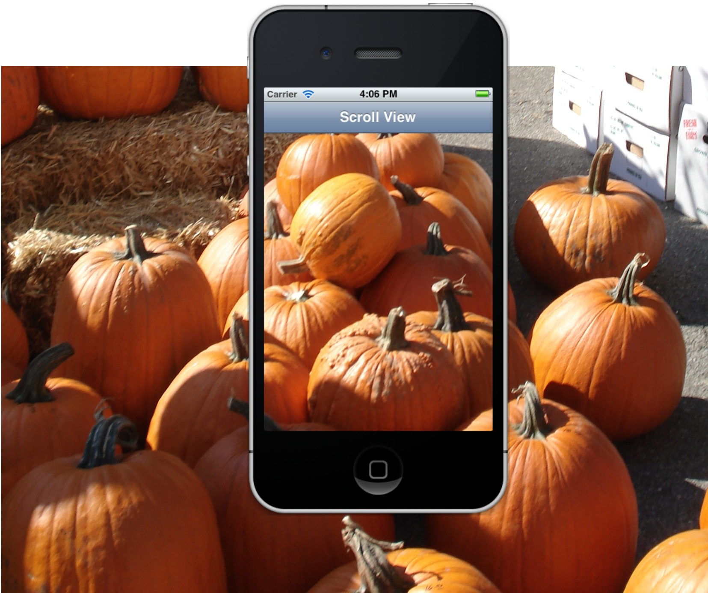

Scroll views are controls that are used to to display and manipulate content
that doesn't fit within the screen. They allow the user to zoom in and out of
the content using pinch gestures and to drag the display area around to view
different parts of the content.

 

&nbsp;

-   [Create a Horizontal Scrolling Button List](/Recipes/ios/content_controls/scroll_view/create_a_horizontal_scrolling_button_list) 
-   [Implement Tap-to-Zoom](/Recipes/ios/content_controls/scroll_view/implement_tap-to-zoom) 
-   [Use a ScrollView](/Recipes/ios/content_controls/scroll_view/use_a_scrollview) 
-   [Zoom a ScrollView](/Recipes/ios/content_controls/scroll_view/zoom_a_scrollview)
