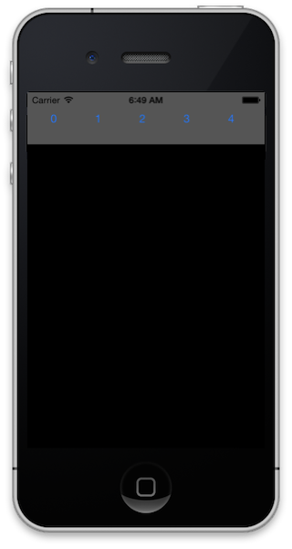

# Recipe

 [ ](Images/scrollingbuttons.png)

 Follow these steps to create a scrolling list of buttons in a
`UIViewController` subclass:

1.  Declare `UIScrollView` and `List<UIButton>` class variables.


```
UIScrollView scrollView;
List<UIButton> buttons;
```

<ol start="2">
  <li>Instantiate the button list <code>List&lt;UIButton&gt;</code> in the constructor.</li>
</ol>

```
public ScrollingButtonsController ()
{
	buttons = new List<UIButton> ();
}
```

<ol start="3">
  <li>Initialize parameters for laying out the buttons.</li>
</ol>

```
public override void ViewDidLoad ()
{
	base.ViewDidLoad ();
    
	nfloat h = 50.0f;
	nfloat w = 50.0f;
	nfloat padding = 10.0f;
	nint n = 25;
	
	…
}
```

<ol start="4">
  <li>Create the <code>UIScrollView</code></li>
</ol>

```
scrollView = new UIScrollView {
                Frame = new CGRect (0, 100, View.Frame.Width, h + 2 * padding),
                ContentSize = new CGSize ((w + padding) * n, h),
                BackgroundColor = UIColor.White,
                AutoresizingMask = UIViewAutoresizing.FlexibleWidth
            };
```

<ol start="5">
  <li>Create buttons and add them to the scroll view.</li>
</ol>

```
for (int i=0; i<n; i++) {
		var button = UIButton.FromType (UIButtonType.RoundedRect);
		button.SetTitle (i.ToString (), UIControlState.Normal);
		button.Frame = new CGRect (padding * (i + 1) + (i * w), padding, w, h);
		scrollView.AddSubview (button);
		buttons.Add (button);
	}
```

<ol start="6">
  <li>Add the <code>UIScrollView</code> as a subview.</li>
</ol>

```
View.AddSubview (scrollView);
```

 <a name="Additional_Information" class="injected"></a>


# Additional Information

The `UIScrollView` will scroll when the `ContentSize` is greater than the size
defined by the `UIScrollView.Frame`. Try experimenting with the layout parameters
in the step 3 to see the effect it has on the button list that is created.

