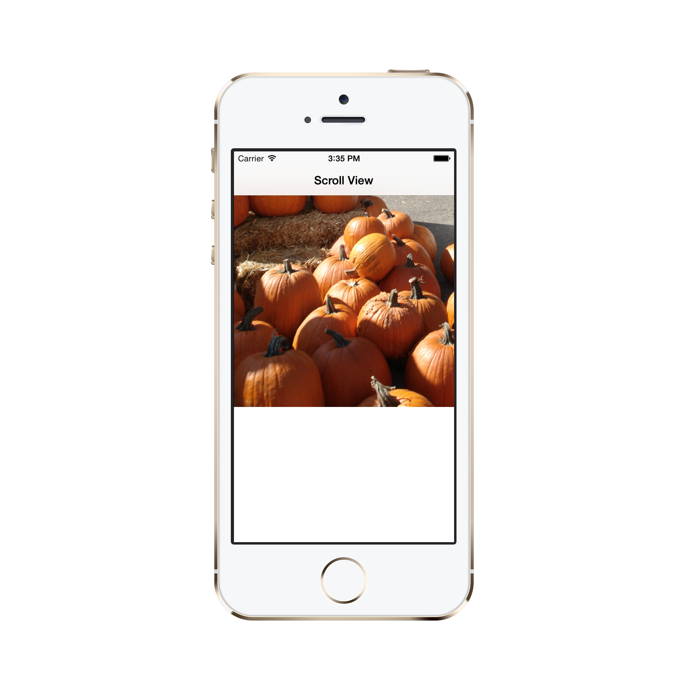
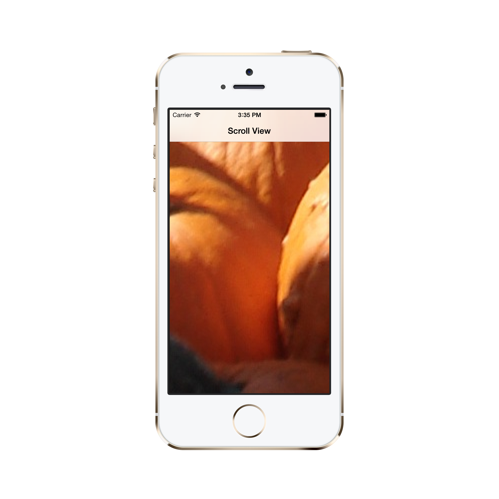

<a name="Recipe" class="injected"></a>


# Recipe

To display an image inside a scroll view and support the double-tap to zoom
gesture:

1. Add the image to your Xamarin.iOS project and ensure the <span class="s2"><strong>Build Action</strong></span> is set to <span class="s2"><strong>BundleResource</strong></span>. The example code loads the image
“halloween.jpg”

2. Declare class level fields for a `UIScrollView` and `UIImageVIew`

```
UIScrollView scrollView;
UIImageView imageView;
```

<ol start="3">
	<li>Create a <span class="s3">UIScrollView</span> and it to the View Controller:</li>
</ol>

```
scrollView = new UIScrollView (
new CGRect (0, 0, View.Frame.Width
, View.Frame.Height - NavigationController.NavigationBar.Frame.Height));
View.AddSubview (scrollView);
```

<ol start="4">
	<li>Create a <code>UIImageView</code> and it to the ScrollView:</li>
</ol>

```
imageView = new UIImageView (UIImage.FromFile ("halloween.jpg"));
scrollView.ContentSize = imageView.Image.Size;
scrollView.AddSubview (imageView);
```

<ol start="5">
	<li>Set the zoom properties:</li>
</ol>

```
scrollView.MaximumZoomScale = 3f;
scrollView.MinimumZoomScale = .1f;
scrollView.ViewForZoomingInScrollView += (UIScrollView sv) => { return imageView; };
```

<ol start="6">
	<li>Create a <code>UITapGestureRecognizer</code> and configure it for two taps, then attach it to the Scroll View:</li>
</ol>

```
UITapGestureRecognizer doubletap = new UITapGestureRecognizer(OnDoubleTap) {
NumberOfTapsRequired = 2 // double tap
};
scrollView.AddGestureRecognizer(doubletap); // detect when the scrollView is double-tapped
```

<ol start="7">
	<li>Implement the handler to change the zoom level when a double-tap is detected on the Scroll View:</li>
</ol>

```
private void OnDoubleTap (UIGestureRecognizer gesture) {
			if (scrollView.ZoomScale >= 1)
				scrollView.SetZoomScale(0.25f, true);
			else
				scrollView.SetZoomScale(2f, true);
		}
```

These screenshots show the image zoomed out and zoomed in:

 [ ](Images/unzoomed.png)

 [ ](Images/zoomed.png)

