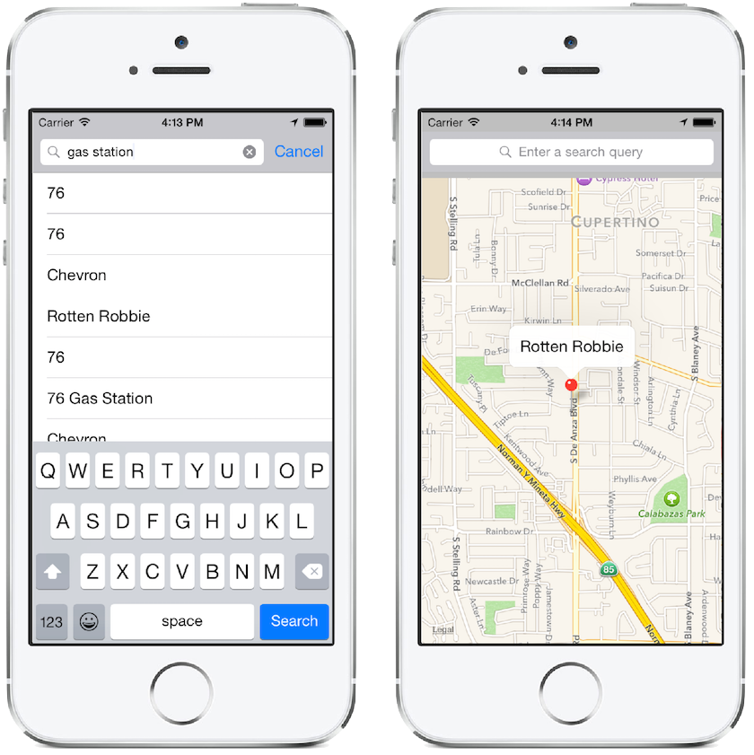

# Overview
`UISearchController` has replaced `UISearchDisplayController` as a way to manage the presentation of a search bar and search results starting with iOS 8. `UISearchDisplayController` is now deprecated.

`UISearchController` is a View Controller that manages all aspects of searching in your application: the search bar, displaying the search results, and updating search results as the user interacts with the search bar:

 

All three of these elements can be configured through properties on the UISearchController:

* `SearchBar`
	- This is created automatically and exposed through a readonly property.
	- You are responsible for placing the SearchBar. For example, if your first View Controller is a TableViewController, you could place it in the header by using the following code:
	```
	TableView.TableHeaderView = SearchController.SearchBar;
	```
* `SearchResultsController`
	- This is the 2nd View Controller in the image above, and displays the results of your search.
	- Any type of View Controller can be used, but usually a TableViewController works best
	- This is passed to the constructor of the search controller.
* `SearchResultsUpdater`
	- You implement this object, but it must adopt the `UISearchResultsUpdating` protocol.
	- It receives notifications about the searches and is responsible for updating the UI
	- It is responsible for updating the results with each keystroke
	- It acts as a mediator between the search controller's search bar and search results.


# Implementing a UISearchController

This is example is taken from the MapDemo sample, and relates to implementing a local search on a map, and then displaying a pin and annonation on the selected result. You can find the full sample in the MapsDemo folder [here](/samples/monotouch/MapDemo/).

## Adding a Local Search UI

The following code adds a `UISearchController` (which has a search bar property) in the `ViewDidLoad` method of `MapViewController`:


```
//Creates an instance of a custom View Controller that holds the results
var searchResultsController = new SearchResultsViewController (map);

//Creates a search controller updater
var searchUpdater = new SearchResultsUpdator ();
searchUpdater.UpdateSearchResults += searchResultsController.Search;

//add the search controller
searchController = new UISearchController (searchResultsController) {
                SearchResultsUpdater = searchUpdater
            };

//format the search bar
searchController.SearchBar.SizeToFit ();
searchController.SearchBar.SearchBarStyle = UISearchBarStyle.Minimal;
searchController.SearchBar.Placeholder = "Enter a search query";

//the search bar is contained in the navigation bar, so it should be visible
searchController.HidesNavigationBarDuringPresentation = false;

//Ensure the searchResultsController is presented in the current View Controller 
DefinesPresentationContext = true;

//Set the search bar in the navigation bar
NavigationItem.TitleView = searchController.SearchBar;
```

##Displaying the Search Results

The following code is an example of how to create the search result custom View Controller:

```
public class SearchResultsViewController : UITableViewController
{
    static readonly string mapItemCellId = "mapItemCellId";
    MKMapView map;

    public List<MKMapItem> MapItems { get; set; }

    public SearchResultsViewController (MKMapView map)
    {
        this.map = map;

        MapItems = new List<MKMapItem> ();
    }

    public override nint RowsInSection (UITableView tableView, nint section)
    {
        return MapItems.Count;
    }

    public override UITableViewCell GetCell (UITableView tableView, NSIndexPath indexPath)
    {
        var cell = tableView.DequeueReusableCell (mapItemCellId);

        if (cell == null)
            cell = new UITableViewCell ();

        cell.TextLabel.Text = MapItems [indexPath.Row].Name;
        return cell;
    }

    public override void RowSelected (UITableView tableView, NSIndexPath indexPath)
    {
        // add item to map
        CLLocationCoordinate2D coord = MapItems [indexPath.Row].Placemark.Location.Coordinate;
        map.AddAnnotations (new MKPointAnnotation () {
            Title = MapItems [indexPath.Row].Name,
            Coordinate = coord
        });

        map.SetCenterCoordinate (coord, true);

        DismissViewController (false, null);
    }

    public void Search (string forSearchString)
    {
        // create search request
        var searchRequest = new MKLocalSearchRequest ();
        searchRequest.NaturalLanguageQuery = forSearchString;
        searchRequest.Region = new MKCoordinateRegion (map.UserLocation.Coordinate, new MKCoordinateSpan (0.25, 0.25));

        // perform search
        var localSearch = new MKLocalSearch (searchRequest);

        localSearch.Start (delegate (MKLocalSearchResponse response, NSError error) {
            if (response != null && error == null) {
                this.MapItems = response.MapItems.ToList ();
                this.TableView.ReloadData ();
            } else {
                Console.WriteLine ("local search error: {0}", error);
            }
        });


    }
}
```

## Updating the Search Results

The following code shows the first step of creating the search method in the `SearchResultsViewController`:

```
public void Search (string forSearchString)
{
    // create search request
    var searchRequest = new MKLocalSearchRequest ();
    searchRequest.NaturalLanguageQuery = forSearchString;
    searchRequest.Region = new MKCoordinateRegion (map.UserLocation.Coordinate, new MKCoordinateSpan (0.25, 0.25));

    // perform search
    var localSearch = new MKLocalSearch (searchRequest);

    localSearch.Start (delegate (MKLocalSearchResponse response, NSError error) {
        if (response != null && error == null) {
            this.MapItems = response.MapItems.ToList ();
            this.TableView.ReloadData ();
        } else {
            Console.WriteLine ("local search error: {0}", error);
        }
    });


}
```

Then creating a custom implementation of `UISearchResultsUpdating`:

```
public class SearchResultsUpdator : UISearchResultsUpdating
{
    public event Action<string> UpdateSearchResults = delegate {};

    public override void UpdateSearchResultsForSearchController (UISearchController searchController)
    {
        this.UpdateSearchResults (searchController.SearchBar.Text);
    }
}
```

 


