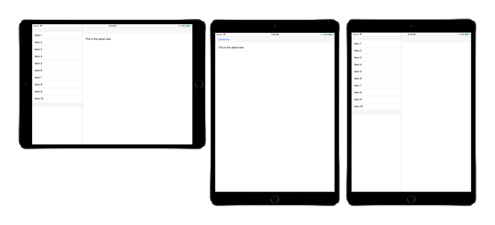

<a name="Recipe" class="injected"></a>


# Recipe

The UISplitViewController can help display a button &amp; popover for the
master view controller when it is hidden. This recipe shows how to add a toolbar
to the detail view and implement the popover button.


 [ ](Images/SplitViewController2.png)

To show and hide the master view:

<ol>
  <li>Start with an existing implementation of <code>UISplitViewController</code>, such as the [Using a Split View to Show Two Controllers](/Recipes/ios/content_controls/split_view/use_split_view_to_show_two_controllers) recipe.</li>
</ol>
<ol start="2">
  <li>Add a toolbar the <code>DetailViewController</code> so that there is a host for the popover button (when it is required):</li>
</ol>


```
// add a toolbar to host the master view popover (when it is required, in portrait)
toolbar = new UIToolbar();
toolbar.TranslatesAutoresizingMaskIntoConstraints = false;
var tbConstraints = new[]
{
    toolbar.LeadingAnchor.ConstraintEqualTo(this.View.SafeAreaLayoutGuide.LeadingAnchor),
    toolbar.TrailingAnchor.ConstraintEqualTo(this.View.SafeAreaLayoutGuide.TrailingAnchor),
    toolbar.TopAnchor.ConstraintEqualTo(this.View.SafeAreaLayoutGuide.TopAnchor, 0.0f),
    toolbar.HeightAnchor.ConstraintEqualTo(toolbar.IntrinsicContentSize.Height)
};
View.AddSubview(toolbar);
NSLayoutConstraint.ActivateConstraints(tbConstraints);
```

<ol start="3">
  <li>Implement two methods on the <code>DetailViewController</code> that will be used to show and hide the button.</li>
</ol>


```
/// <summary>
/// Shows the button that allows access to the master view popover
/// </summary>
public void AddContentsButton (UIBarButtonItem button)
{
    button.Title = "Contents";
	toolbar.SetItems (new UIBarButtonItem[] { button }, false );
}

/// <summary>
/// Hides the button that allows access to the master view popover
/// </summary>
public void RemoveContentsButton ()
{
    toolbar.SetItems (new UIBarButtonItem[0], false);
}
```

<ol start="4">
  <li>Implement a <code>UISplitViewControllerDelegate</code> the <code>SplitViewController</code> to control when the button is shown or hidden:</li>
</ol>


```
public class SplitViewDelegate : UISplitViewControllerDelegate {
    public override bool ShouldHideViewController (UISplitViewController svc, UIViewController viewController, UIInterfaceOrientation inOrientation)
    {
        return inOrientation == UIInterfaceOrientation.Portrait
            || inOrientation == UIInterfaceOrientation.PortraitUpsideDown;
    }

    public override void WillHideViewController (UISplitViewController svc, UIViewController aViewController, UIBarButtonItem barButtonItem, UIPopoverController pc)
    {
        DetailViewController detailView = svc.ViewControllers[1] as DetailViewController;
        detailView.AddContentsButton (barButtonItem);
    }

    public override void WillShowViewController (UISplitViewController svc, UIViewController aViewController, UIBarButtonItem button)
    {
        DetailViewController detailView = svc.ViewControllers[1] as DetailViewController;
        detailView.RemoveContentsButton ();
    }
}
```

<ol start="5">
  <li>Set the <code>Delegate</code> in the <code>SplitViewController's</code> constructor:</li>
</ol>


```
Delegate = new SplitViewDelegate();
```

 <a name="Additional_Information" class="injected"></a>


# Additional Information

The example above does not include any interaction between the views. See the [Communicating Between Detail and Master Controllers](/Recipes/ios/content_controls/split_view/communicate_between_master_and_detail_controllers) recipe.

You can change the behavior of the <code>SplitViewController</code> to always show the master view (or always show the button &amp; popover) by returning <code>false</code> or <code>true</code> respectively from <code>ShouldHideViewController</code>.

