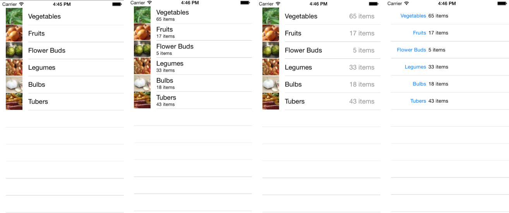

Tables are one of the single most important controls in iOS applications.
It's hard to find an application that doesn't use tables in some form. Tables in
iOS are highly customizable and wrap a lot of functioality that we get for
free.

 

 

# Table Basics

-   [Populate a Table](/Recipes/ios/content_controls/tables/populate_a_table) 
-   [Handle a Row Click](/Recipes/ios/content_controls/tables/handle_a_row_click) 

 

# Customization

-   [Specify the Cell Type](/Recipes/ios/content_controls/tables/specify_the_cell_type) 
-   [Add a Cell Accessory](/Recipes/ios/content_controls/tables/add_a_cell_accessory) 

 

# Other

-   [Create a Login Window Using MonoTouch.Dialog](/Recipes/ios/content_controls/tables/create_a_login_window_using_monotouch.dialog)
