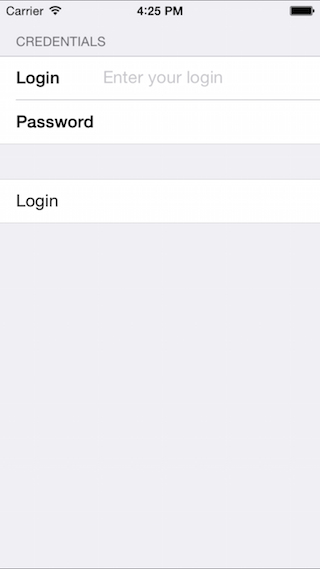

<a name="Recipe" class="injected"></a>


# Recipe

<ol>
  <li>Create a new iPhone application named MTDLogin. For this example we'll use the Empty Project template.</li>
  <li>Add a reference to the <code>MonoTouch.Dialog-1</code> assembly by double clicking on <strong>References</strong> in the <strong>Solution Pad</strong> and selecting <strong>MonoTouch.Dialog-1</strong> from the list as shown below:</li>
</ol>

 [ ](Images/image2.png)


<ol start="3">
  <li>Click OK in the <strong>Edit Reference</strong> dialog to add the reference. </li>  
  <li>In the <strong>AppDelegate.cs</strong> file add a <strong>MonoTouch.Dialog</strong> using statement:</li>
</ol>
```
using MonoTouch.Dialog;
```
<ol start="5">
  <li>In the <code>FinishedLaunching</code> method set the <code>RootViewController</code> property of the window to an instance of a <code>DialogViewController</code>, passing a <code>RootElement</code> with the string "Login" to the <code>DialogViewController</code>:</li>
</ol>

```
window.RootViewController = new DialogViewController (new RootElement("Login"));
```

<ol start="6">
  <li>Add a <code>Section</code> instance with the string <strong>"Credentials"</strong> to the <code>RootElement</code>:</li>
</ol>

```
window.RootViewController = new DialogViewController (new RootElement("Login") {
    new Section ("Credentials")
});
```

<ol start="7">
  <li>Add an <code>EntryElement</code> to the section, passing the strings <strong>"Login"</strong>, <strong>"Enter you login"</strong> and an empty string to the <code>EntryElement</code> constructor:</li>
</ol>

```
window.RootViewController = new DialogViewController (new RootElement("Login") {
  new Section ("Credentials"){
  new EntryElement ("Login", "Enter your login", "")
 }
});
```

<ol start="8">
  <li>Add a second <code>EntryElement</code> to the section, passing the string <strong>"Password"</strong> along with two empty strings. Also pass <code>true</code> for the fourth argument to the constructor so that the password text will be not be displayed after it is entered by the user:</li>
</ol>

```
window.RootViewController = new DialogViewController (new RootElement("Login") {
 new Section ("Credentials"){
  new EntryElement ("Login", "Enter your login", ""),
  new EntryElement ("Password", "", "", true)
 }
});
```
<ol start="9">
  <li>Add a second section to the <code>RootElement</code>:</li>
</ol>

```
window.RootViewController = new DialogViewController (new RootElement("Login") {
 new Section ("Credentials"){
  new EntryElement ("Login", "Enter your login", "")
 },
 new Section () {
 }
});
```

<ol start="10">
  <li>Add a <code>StringElement</code> to the second <code>Section</code> with the string <strong>"Login"</strong> for the first argument to its constructor and a delegate for the second argument.</li>
</ol>

```
window.RootViewController = new DialogViewController (new RootElement("Login") {
 new Section ("Credentials"){
    new EntryElement ("Login", "Enter your login", "")
 },
  new Section () {
  new StringElement ("Login", delegate {

    })
 }
});
```

<ol start="11">
  <li>Add two <code>EntryElement</code> class variables to the <code>AppDelegate</code> class named <strong>login</strong> and <strong>password</strong> respectively:</li>
</ol>

```
[Register ("AppDelegate")]
public partial class AppDelegate : UIApplicationDelegate
{
 EntryElement login, password;

 ...
}
```

<ol start="12">
  <li>Go back to the <code>EntryElements</code> created in step 8 and assign them to the <code>login</code> and <code>password</code> variables:</li>
</ol>

```
window.RootViewController = new DialogViewController (new RootElement("Login") {
 new Section ("Credentials"){
  (login = new EntryElement ("Login", "Enter your login", "")),
  (password = new EntryElement ("Password", "", "", true))
 }
});
```
<ol start="13">
  <li>Add the following code to the delegate created in step 9 to access the username when the login button is clicked:</li>
</ol>

```
window.RootViewController = new DialogViewController (new RootElement ("Login") {
 new Section ("Credentials"){
  (login = new EntryElement ("Login", "Enter your login", "")),
  (password = new EntryElement ("Password", "", "", true))
 },
  new Section () {
    new StringElement ("Login", delegate{
      Console.WriteLine ("User {0} log-in", login.Value); })  
 }
});
```


<ol start="14">
  <li>Run the application, enter a username and password, and click login. The username is printed to the <strong>Application Output</strong> in Visual Studio for Mac when the login button is clicked, as shown below:</li>
</ol>

 [ ](Images/image3.png)

