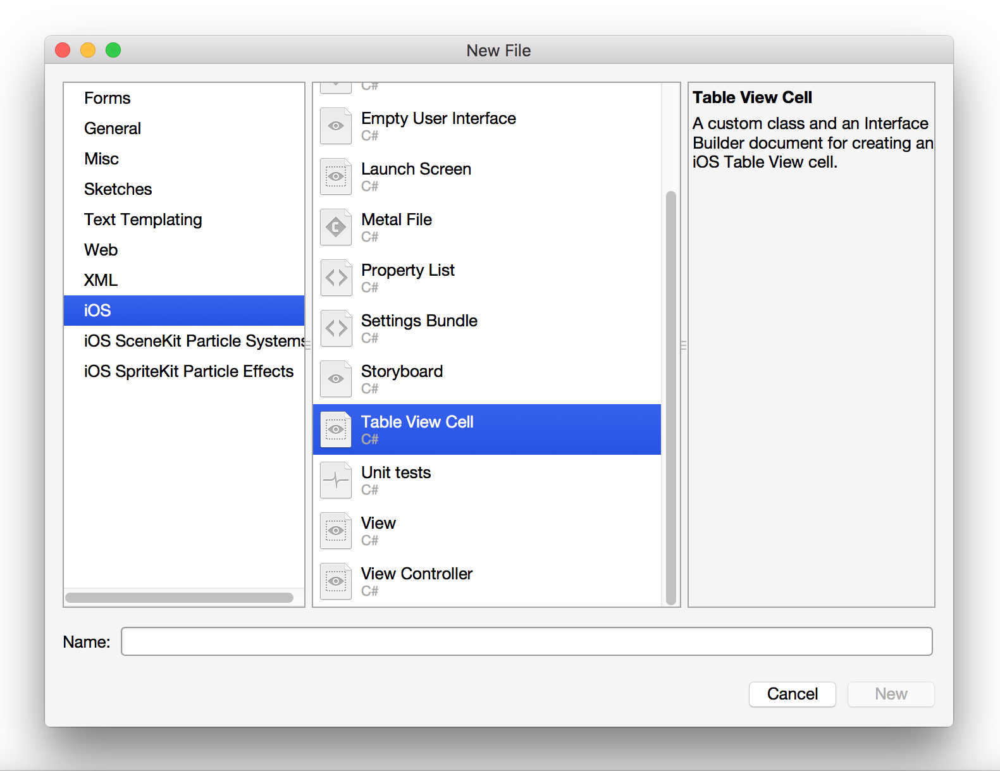

# Referencing the Custom Cell

1. Create a new Master Detail Solution and name it **CustomCellDemo**.

## Visual Studio for Mac

1.  Open the `Main.Storyboard` file and right-click on the table cell in the **Master View Controller** to delete it:  
    
2.  Add a new file by right-clicking on the solution name and selecting _Add > New File..._. Select the **TableViewCell** template, and name it **Cell**:  
      
    This will create a .xib file plus a backing class
3.  Double click on the Cell.xib file to open it in the iOS Designer
4.  In the properties panel, change the background color.
5.  To register the .xib for cell reuse, add the following line of code to the `MasterViewController` class before you set `TableView.Source` in the `ViewDidLoad()` method:

		public override void ViewDidLoad ()
		{
			base.ViewDidLoad ();

			...

			TableView.RegisterNibForCellReuse(Cell.Nib, "Cell");
			TableView.Source = dataSource = new DataSource (this);
		}

6.  Run the application and test it, you should notice that the background color of the cell, matches the background color of the cell in your .xib.

## Visual Studio

1.  Open the `Main.Storyboard` file and right-click on the table cell in the **Master View Controller** to delete it:  
    
2.  Add a new item by right-clicking on the solution name and selecting _Add > New Item..._. Select the View template and name it **Cell**:  
      
    This will create a .xib file with **no** backing class
3.  If the .xib file doesn't open automatically, double-click on the **Cell.xib** file to open it in the Designer.
4.  Delete the View on the design surface and add a **Table View Cell** from the toolbox:  
    
5.  We now need to give it a code behind class so that we can access the .xib in code. To do this select the Table View Cell, and in the properties explorer under _Identity > Class_ enter `Cell`:  
    
6.  In the properties panel, change the background color:  
    
7.  To register the .xib for cell reuse, add the following line of code to the `MasterViewController` class before you set `TableView.Source` in the `ViewDidLoad()` method:

		public override void ViewDidLoad ()
		{
			base.ViewDidLoad ();

			...

			TableView.RegisterNibForCellReuse(UINib.FromName("Cell", null), "Cell”);
			TableView.Source = dataSource = new DataSource (this);
		}

8.  Run the application and test it, you should notice that the background color of the cell, matches the background color of the cell in your .xib.

