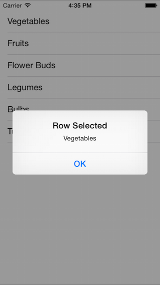

<a name="Recipe" class="injected"></a>


# Recipe

To respond to a user’s touch in a `UITableView`:

* First, let's create an `AlertController` to display a message when the user click on a row by adding the following to the RowSelected method:

```
public override void RowSelected (UITableView tableView, NSIndexPath indexPath)
{
    UIAlertController okAlertController = UIAlertController.Create ("Row Selected", tableItems[indexPath.Row], UIAlertControllerStyle.Alert);
    okAlertController.AddAction(UIAlertAction.Create("OK", UIAlertActionStyle.Default, null));
    ...

    tableView.DeselectRow (indexPath, true);
}
```

* Next, create an instance of our View Controller:

```
HomeScreen owner;
```

* Add a constructor to your `UITableViewSource` class which takes a view controller as a parameter and saves it in a field:

```
public TableSource (string[] items, HomeScreen owner)
{
    ...
    this.owner = owner;

}
```

* Modify the ViewDidLoad method where the `UITableViewSource` class is created to pass the this reference:

```
table.Source = new TableSource(tableItems, this);
```

* Finally, back in your `RowSelected` method, call `PresentViewController` on the cached field:

```
public override void RowSelected (UITableView tableView, NSIndexPath indexPath)
{
    ...
    owner.PresentViewController (okAlertController, true, null);

    ...
}
```

Now the user can touch a row and an alert will appear:

 [ ](Images/Handle_a_Row_Click1.png) [ ](Images/Handle_a_Row_Click2.png)

 <a name="Additional_Information" class="injected"></a>


# Additional Information

The complete `UITableViewSource` code is shown below for reference:

```
public class TableSource : UITableViewSource {
		
		protected string[] tableItems;
		protected string cellIdentifier = "TableCell";
		HomeScreen owner;
	
		public TableSource (string[] items, HomeScreen owner)
		{
			tableItems = items;
			this.owner = owner;
		}
	
		/// <summary>
		/// Called by the TableView to determine how many cells to create for that particular section.
		/// </summary>
		public override nint RowsInSection (UITableView tableview, nint section)
		{
			return tableItems.Length;
		}
		
		/// <summary>
		/// Called when a row is touched
		/// </summary>
		public override void RowSelected (UITableView tableView, NSIndexPath indexPath)
		{
			UIAlertController okAlertController = UIAlertController.Create ("Row Selected", tableItems[indexPath.Row], UIAlertControllerStyle.Alert);
			okAlertController.AddAction(UIAlertAction.Create("OK", UIAlertActionStyle.Default, null));
			owner.PresentViewController (okAlertController, true, null);
		
			tableView.DeselectRow (indexPath, true);
		}
		
		/// <summary>
		/// Called by the TableView to get the actual UITableViewCell to render for the particular row
		/// </summary>
		public override UITableViewCell GetCell (UITableView tableView, NSIndexPath indexPath)
		{
			// request a recycled cell to save memory
			UITableViewCell cell = tableView.DequeueReusableCell (cellIdentifier);
			// if there are no cells to reuse, create a new one
			if (cell == null)
				cell = new UITableViewCell (UITableViewCellStyle.Default, cellIdentifier);

			cell.TextLabel.Text = tableItems[indexPath.Row];
			
			return cell;
		}
	}
```

