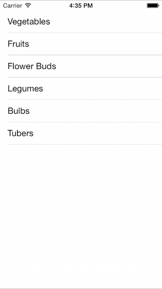

<a name="Recipe" class="injected"></a>


# Recipe

A table in iOS requires both a `UITableView` to present the data and a
`UITableViewSource` to supply to the data.

To create and populate a table:

-  First create a `UITableView` instance and add it to a view (see the *HomeScreen.cs* `ViewDidLoad` method in the sample):


```
table = new UITableView(View.Bounds);
Add (table);
```

-  Create a subclass of `UITableViewSource` that accepts an array of strings. Override the `RowsInSection` and `GetCell` methods as shown (in the *TableSource.cs* sample file):


```
public class TableSource : UITableViewSource {
    protected string[] tableItems;
    protected string cellIdentifier = "TableCell";
    public TableSource (string[] items)
    {
        tableItems = items;
    }
    public override int RowsInSection (UITableView tableview, int section)
    {
        return tableItems.Length;
    }
    public override UITableViewCell GetCell (UITableView tableView, NSIndexPath indexPath)
    {
        // request a recycled cell to save memory
        UITableViewCell cell = tableView.DequeueReusableCell (cellIdentifier);
        // if there are no cells to reuse, create a new one
        if (cell == null)
            cell = new UITableViewCell (UITableViewCellStyle.Default, cellIdentifier);
        cell.TextLabel.Text = tableItems[indexPath.Row];
        return cell;
    }
}
```

-  Create an array of strings:


```
string[] tableItems = new string[] {"Vegetables","Fruits","Flower Buds","Legumes","Bulbs","Tubers"};
```

-  Instantiate the `UITableViewSource` with the array, and set the `Source` property on the table.


```
table.Source = new TableSource(tableItems);
```

-  The table will be displayed.


 [ ](Images/PopulateATable.png)

 <a name="Additional_Information" class="injected"></a>


# Additional Information

The steps above only display a table, it does not accept user input. To show
an alert when the user touches a row, refer to the recipe [Handle a Row Click](/Recipes/ios/content_controls/tables/handle_a_row_click/).

