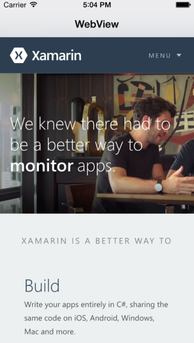

The Web View control allows you to easily add a web browser to you
application. In addition to pages hosted on the web, you can also use it to
display local content (including various document formats), and you can even
interact with JavaScript in pages it has loaded.

 

- [Load a Web Page](/Recipes/ios/content_controls/web_view/load_a_web_page)
- [Load Local Content](/Recipes/ios/content_controls/web_view/load_local_content)
- [Load Non-Web Documents](/Recipes/ios/content_controls/web_view/load_non-web_documents)
- [Handle JavaScript Alerts](handle_javascript_alerts/)

