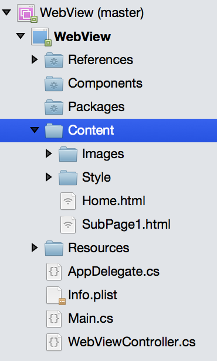

# Recipe

To show local Html content in a `UIWebView`:

<ol start="1">
  <li>Add the files to your Xamarin.iOS project - in this example the HTML, images and style sheets
  have all been placed inside a <b>Content</b> folder in the project.
  Remember to set the <b>Build Action</b> to <b>BundleResource</b> for all files.
</li>
</ol>



<ol start="2">
  <li>Create a <code>UIWebView</code> and add it to a view:</li>
</ol>


```
webView = new UIWebView (View.Bounds);
View.AddSubview(webView);
```

<ol start="3">
  <li>Load the file using <code>NSUrlRequest</code> and <code>NSUrl</code> classes:</li>
</ol>


```
// Note the Content folder is where we placed the files
string fileName = "Content/Home.html"; // remember case-sensitive
string localHtmlUrl = Path.Combine (NSBundle.MainBundle.BundlePath, fileName);
webView.LoadRequest(new NSUrlRequest(new NSUrl(localHtmlUrl, false)));
webView.ScalesPageToFit = false;
```


# Additional Information

Html generated in code can also be displayed, which is useful for customizing
the content. To display an Html string, use the `LoadHtmlString` method instead of
`LoadRequest`. Passing the path to the Content directory helps the web view
resolve relative Urls in the Html, such as links, images, CSS, etc.

```
// assumes you've placed all your files in a Content folder inside your app
string contentDirectoryPath = Path.Combine (NSBundle.MainBundle.BundlePath, "Content/");
string html = "<html><a href='Home.html'>Click me</a></html>";
webView.LoadHtmlString(html, new NSUrl(contentDirectoryPath, true));
```


 &nbsp;

