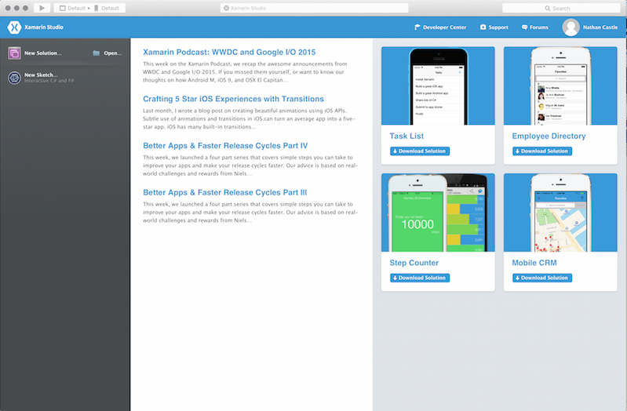
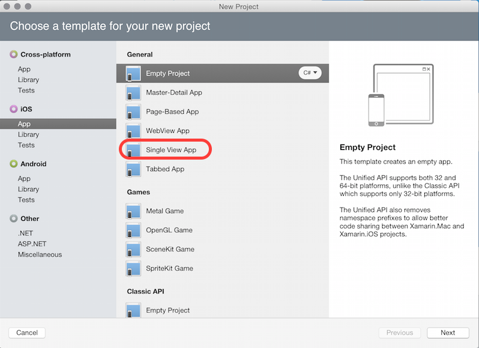
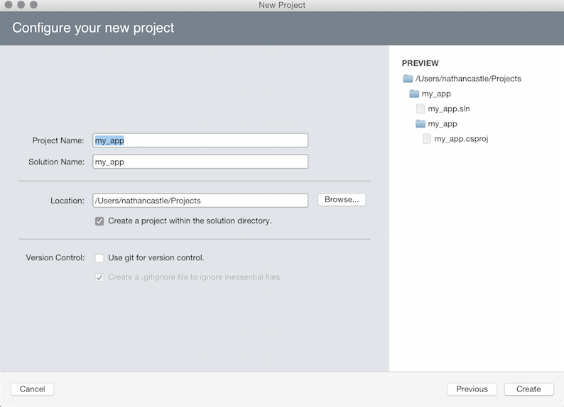
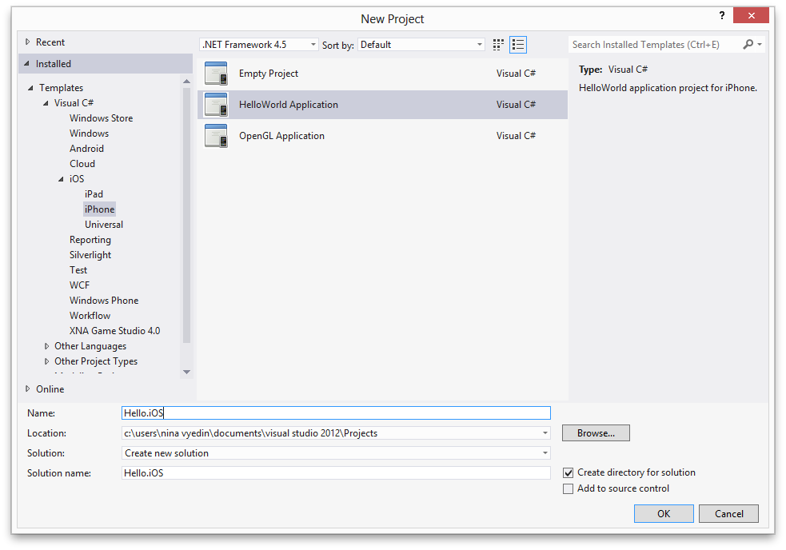
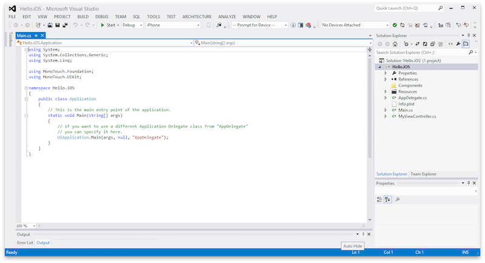

# Recipe

## Create an iOS Project in Visual Studio for Mac

1.  First, launch Visual Studio for Mac and click **+ New Solution...** in the upper left corner: 
2.  A window will pop up asking you to choose a template for the project. Select **App** under **iOS** in the panel on the left. Then select the desired app type from the list of options and click **Next**. If you are new to Xamarin.iOS and don't know which to choose, select **Single View Application**. 
3.  The window will move to the **Configure your iOS app** screen. Enter the name of your app, select the devices you'd like to support and choose a minimum target OS. 
4.  The window will move to the **Configure your new project** screen. Choose the name of the project (avoiding spaces and special characters) and the location on disk to store the project, then click **Create**
5.  Visual Studio for Mac will create your new iOS app. 

## Create an iOS Project in Visual Studio

1.  [Make sure Xamarin.iOS for Visual Studio is configured correctly](https://developer.xamarin.com/guides/ios/getting_started/introduction_to_xamarin_ios_for_visual_studio). Launch Visual Studio and choose **File > New > Project**:
2.  A window will pop up with a list of options for the types of projects available to you. To create an iOS project, choose the **Templates** and then the **Visual C#** category to open up the available sub-categories, then select **iOS**:
3.  Choose your device from the menu on the left. If you are new to Xamarin.iOS and unsure about what template to use, select **Single View Application** from the panel on the right. This will create an application with one view and one View Controller.
4.  Choose a sensible name for your project, avoiding spaces and special characters, and click **OK**.
5.  Visual Studio will create and populate a new project for you:
