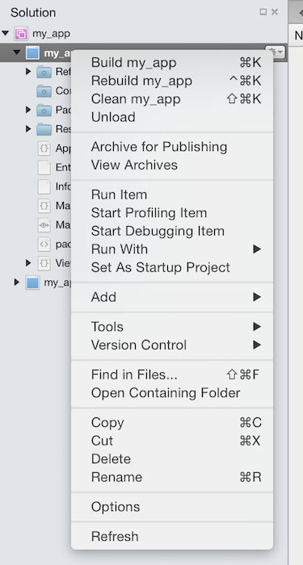

# Recipe

## Set Default Namespace in Visual Studio for Mac

1.  Double click on the project in the **Solution Pad**, or right-click on the project and select **Options**:  
    
2.  Choose **Main Settings** to view the **Default Namespace** field:
3.  This value will be automatically set as the root namespace in each new code file you create in your project, including the `.designer.cs` partial classes created when you add a XIB or Storyboard file.

## Set Default Namespace in Visual Studio

1.  Open the project **Properties**, and then choose the **Application** panel: 

## Additional Information

If you edit the default namespace value in an existing project,
it will *NOT* update existing files, so beware that editing this value will result in two different root namespaces in your project.

