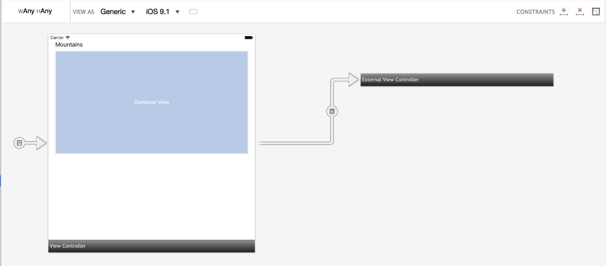
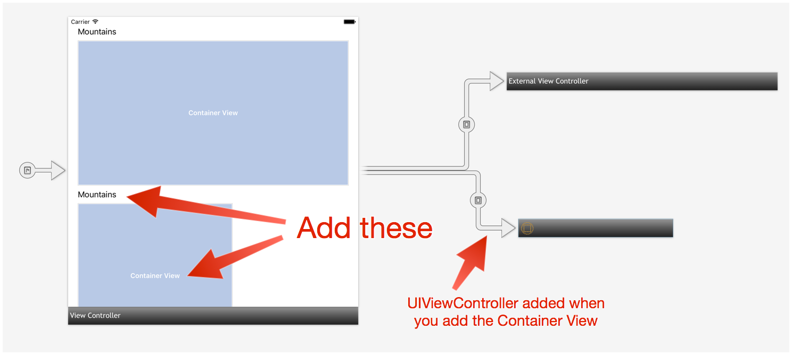
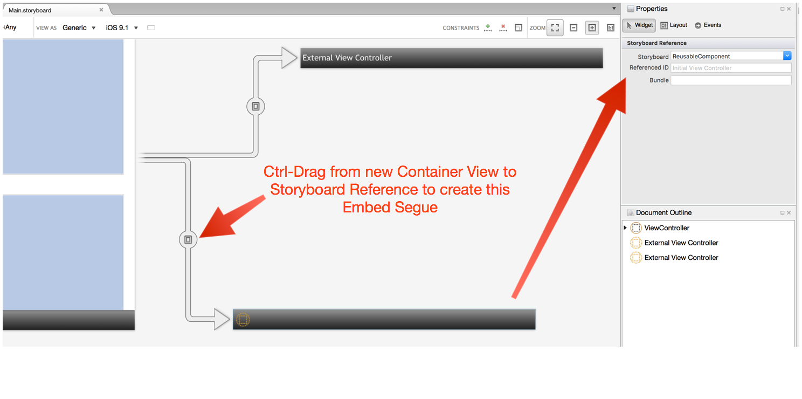

Container views are used in Storyboards to embed `UIView`s that are controlled by children `UIViewController` objects. Such "container views" are strictly a Storyboard concept: there is not an iOS class or interface that distinguishes such container views from any other view. Since a container view is just a normal `UIView`, it does not have a property named, for instance, `EmbeddedController` to retrieve the child `UIViewController`. There are several potential strategies for the parent `UIViewController` to retrieve a reference to a child `UIViewController`, but the most robust method, described here, is to use a named embed segue.

The sample app uses container views and external storyboard references to present a scrolling view of different pictures. As the user pages through them, the name of the selected picture is displayed.  

The scrolling of the images is controlled by a custom `UIViewController` called `ImageSelectorViewController`. It exposes an event called `ImageSelected` that passes out the name of the current image. For the parent `UIViewController` to use that information (in this case, to update a label), of course it needs a strongly-typed reference to the child `ImageSelectorViewController`.

To see how this is done, open the "Walkthrough" project in the sample code and open the Main.storyboard file. You should see the following:



For the walkthrough, we want to duplicate the UI of a label and scrolling embedded container view.

Drop a new `UILabel` on the main `ViewController` below the existing container view. Set their constraints so that they are properly aligned with the existing container view. In the Identity pane of the Widget panel of the Properties pad, set the Name of the Label to `bottomPictureLabel`. The iOS Designer will generate a matching instance variable in the code-behind file.

Now, drop a Container View on the main `ViewController` below the `bottomPictureLabel`. When you do this, a `UIViewController` and segue from the Container View will be automatically placed on the Storyboard. You should end up with something like:



## Recipe

Delete the newly-created `UIViewController`. This will also delete the segue from the Container View.

Drop a "Storyboard Reference" onto the storyboard.

Ctrl-drag from the Container View to the Storyboard Reference to create a new segue from the Container View and select "Embed" as the type of segue. (In Xamarin Studio 5.10 and earlier, you may need to turn off "Use Size Classes" in the Storyboard Document panel to be able to add the segue.) Click on the embed segue and name it `PictureBEmbed`.

Now, click on the Storyboard Reference and in the Widget panel, set it's Storyboard property to "ReusableComponent" The "ReusableComponent.storyboard" file is already in the project. The "ReusableComponent.storyboard" specifies the `ImageSelectorViewController` as it's controller class). Your storyboard should look like:



Save the storyboard. If you run the program now, you will be able to scroll through the images in the lower container view because it is controlled by an `ImageSelectorViewController`, but the `bottomPictureLabel` label you added will not change. To add that functionality, open the ViewController.cs file and change the overridden `PrepareForSegue` method to the following:

```
public override void PrepareForSegue(UIStoryboardSegue segue, Foundation.NSObject sender)
{
    switch (segue.Identifier)
    {
        case "PictureAEmbed":
            var topSelectorViewController = (ImageSelectorViewController)segue.DestinationViewController;
            topSelectorViewController.ImageSelected += (s, e) => topPicture.Text = e.Value;
            break;
       case "PictureBEmbed":
            var bottomViewController = (ImageSelectorViewController)segue.DestinationViewController;
            bottomViewController.ImageSelected += (s, e) => bottomPictureLabel.Text = e.Value;
            break;
       default:
            //Another segue
            break;
    }
}
```

The code you've added is the `case` for "PictureBEmbed" (this must exactly match the name of the embed segue from your container view to your storyboard reference). Because the "ReusableComponent" storyboard's initial view controller is of type `ImageSelectorViewController`, the downcast of `segue.DestinationViewController` from the generic `UIViewController` will succeed.

Then, the `ImageSelected` event for the strongly-typed `bottomViewController` reference is connected to the `bottomLabelPicture` variable that backs the label you recently created in the storyboard.

(Note: subscribing to the `ImageSelected` event prevents the `ImageSelectorViewController` from being garbage-collected and that is all this use-case requires, but in many cases, you'll want to keep a class reference to your embedded `UIViewController` so that it does not get collected.)

## Additional Information

Ideally, a Storyboard would treat an embedded `UIViewController` no differently than an embedded `UILabel` and one could name the embedded controller in the designer and have it sync with the code-behind file. This is not supported by Apple.

Instead, the method described here, to use the `DestinationViewController` of a named embed segue, is the preferred method to get a reference to an embedded `UIViewController`. Once the reference is retrieved, it can be downcast to the real subtype. Obviously, string mismatches and improper downcasts cannot be caught by the type-checker at compile time, but it is in the nature of Storyboards and xibs to have this dynamic component.

The `PrepareForSegue` method is called prior to `ViewDidLoad`.

