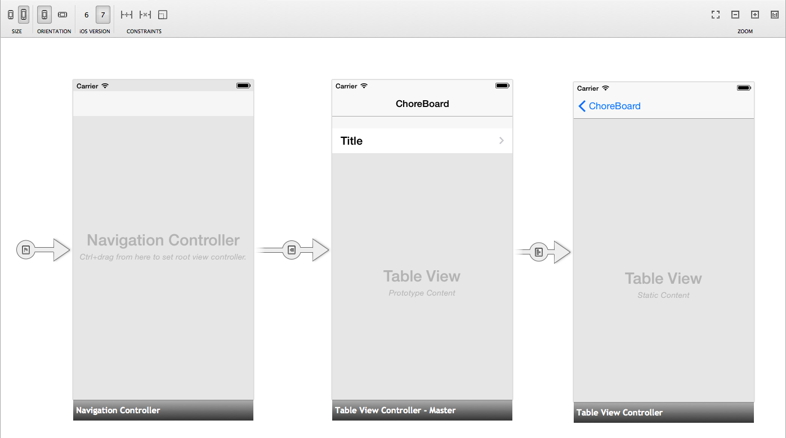
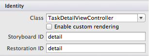
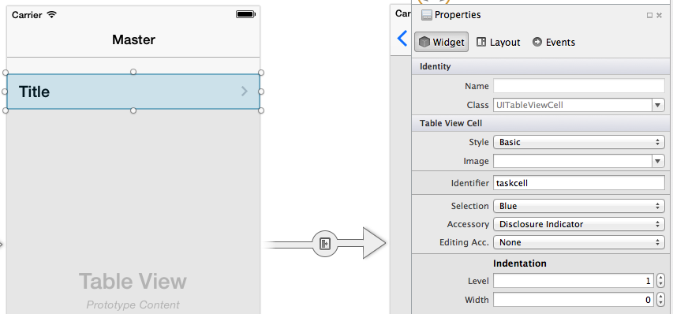
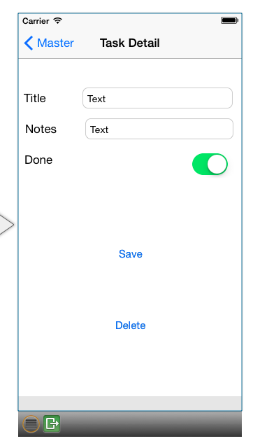
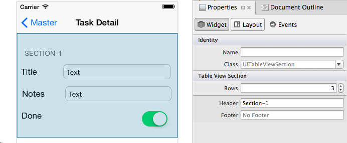
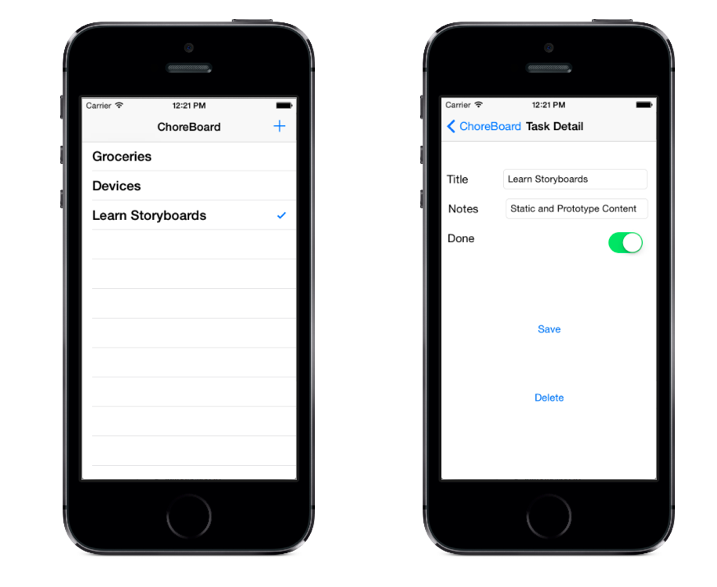

<a name="Recipe" class="injected"></a>


# Storyboard Tables

It is possible to use a Storyboard to create custom Table Views. This recipe demonstrates how to create both Dynamic Prototype and Static content for cells in a table using the Storyboard.

# Recipe

To create a Storyboard-based application using a TableView:

Create a new solution in Visual Studio for Mac using **File > Solution > iOS > iPhone Storyboard > Master-Detail Application**.

 [ ](Images/image14a.png)

Double-click the `.storyboard` file to open it in the iOS Designer:

 [ ](Images/image20a.png)

We will modify the storyboard in three steps:

-  First, we will layout the required view controllers and set their properties.


-  Secondly, we will create the UI by dragging and dropping objects onto the view.


-  Finally, we will add the required UIKit class to each view and give various controls a name.


Once the storyboard is complete, code can be added to run the table.

# Layout The View Controllers

Let's follow these steps to delete the existing Detail view and replace it with a UITableViewController:

-  Select the black bar at the bottom of the Detail View and delete it.


-  Drag a UITableViewController onto the Storyboard from the Object Library.


-  Create a segue from the Master View Controller to the View Controller that was just added. To create the segue, Control+drag from the Detail cell to the newly added UITableViewController. Choose the option Push under Segue Selection


-  Select the new segue you created and give it an identifier to reference this segue in code. Click on the segue and enter “TaskSegue” for the Identifier in the  **Properties Pad** , like this:


 [ ](Images/image16a.png)

-  Change the Master View to be  *Content: Dynamic Prototypes* (the View on the Design Surface will be labelled  *Prototype Content* ).


-  Change the new UITableViewController to be  *Content: Static Cells* .


-  Select the View Controller and type  *TaskDetailViewController* for the Class in the Properties Pad.


-  Finally, enter the StoryboardID as detail, illustrated in the example below.


 [ ](Images/image18a.png)

Once we change the Master view's title to "Choreboard", the storyboard design surface should look like this:

 [ ](Images/image20a.png)

# Create the UI

First, select the prototype cell in the Master View Controller and set the Identifier as *taskcell*, as illustrated below:

 [ ](Images/image22a.png)

Next, follow these steps to create a button that will add new tasks:

-  Drag a Bar Button Item from the Toolbox into the navigation bar


-  In the Properties Pad, under Bar Button Item select Identifier: Add (to make it a "+" button).


-  Enter "AddButton" as the Name. This will enable us to refer to it in code at a later stage.


Now we must build the DetailView. The screenshot below shows the finished UI:

 [ ](Images/image24a.png)

To build the complete layout, first select the table view and open the Property Pad. Update the following properties as follows:

-  Sections:  *2*


-  Style:  *Grouped*


-  Seperator:  *None*


-  Selection:  *No Selection*


Now, select the top section of the DetailView and under **Properties > Table View Section** change rows to '3', as illustrated below:

 [ ](Images/image29.png)

For each cell in Section 1 open the **Properties Pad** and set:

-  Style:  *Custom*


-  Identifier: choose a unique identifier for each cell (eg. “title”, “notes”, “done”).


-  Drag the required controls to produce the layout shown in the screenshot (place UILabel, UITextField and UISwitch on the correct cells, and set the labels appropriately, ie. Title, Notes and Done).


-  Selection:  *No Selection*


In the second section, set the number of Rows to 1 and grab the bottom resize handle to make it taller. Select the cell in the **Properties pad** and set:

-  Identifier:  *to a unique value in the Property Pad(eg. “save”)* .


-  Background:  *Clear Color*


-  Drag two buttons onto the cell and set their titles appropriately (i.e. Save and Delete).


The last step in creating our Storyboard is giving each of our controls a name under **Identity > Name**. Name these as follows:

-  Title UITextField: TitleText


-  Notes UITextField: NotesText


-  UISwitch: DoneSwitch


-  Delete UIButton: DeleteButton


-  Save UIButton: SaveButton


# Adding Code

Our storyboard is now complete, now we must add code to run the application.

First, create a Chores class and add the following code:

```
public class Chore {

public Chore ()
{
}

public int Id { get; set; }
public string Name { get; set; }
public string Notes { get; set; }
public bool Done { get; set; }


}
```

Next, create a `RootTableSource` class that inheirits from `UITableViewSource`. Populate the class with the following code:

```
public class RootTableSource : UITableViewSource {

// there is NO database or storage of Tasks in this example, just an in-memory List<>
Chore[] tableItems;
string cellIdentifier = "taskcell"; // set in the Storyboard

public RootTableSource (Chore[] items)
{
  tableItems = items;
}
public override nint RowsInSection (UITableView tableview, nint section)
{
  return tableItems.Length;
}
public override UITableViewCell GetCell (UITableView tableView, NSIndexPath indexPath)
{
  // in a Storyboard, Dequeue will ALWAYS return a cell,
  UITableViewCell cell = tableView.DequeueReusableCell (cellIdentifier);
  // now set the properties as normal
  cell.TextLabel.Text = tableItems[indexPath.Row].Name;
  if (tableItems[indexPath.Row].Done)
    cell.Accessory = UITableViewCellAccessory.Checkmark;
  else
    cell.Accessory = UITableViewCellAccessory.None;
  return cell;
}

public Chore GetItem(nint id) {
  return tableItems[id];
}
}
```

Next, replace the code in the `MasterViewController` with the following code:

```
using System;
using System.Drawing;
using System.Collections.Generic;

using Foundation;
using UIKit;

namespace StoryboardTable
{
    public partial class MasterViewController : UITableViewController
    {
        List<Chore> chores;

    public MasterViewController (IntPtr handle) : base (handle)
    {
        Title = "ChoreBoard";

        // Custom initialization
        chores = new List<Chore> {
        new Chore() {Name="Groceries", Notes="Buy bread, cheese, apples", Done=false},
        new Chore() {Name="Devices", Notes="Buy Nexus, Galaxy, Droid", Done=false}
    };

    }

    public override void PrepareForSegue (UIStoryboardSegue segue, NSObject sender)
    {
        if (segue.Identifier == "TaskSegue") { // set in Storyboard
            var navctlr = segue.DestinationViewController as TaskDetailViewController;
            if (navctlr != null) {
                var source = TableView.Source as RootTableSource;
                var rowPath = TableView.IndexPathForSelectedRow;
                var item = source.GetItem(rowPath.Row);
                navctlr.SetTask (this, item); // to be defined on the TaskDetailViewController
            }
        }
    }

    public void CreateTask ()
    {
        // first, add the task to the underlying data
        var newId = chores[chores.Count - 1].Id + 1;
        var newChore = new Chore(){Id=newId};
        chores.Add (newChore);

        // then open the detail view to edit it
        var detail = Storyboard.InstantiateViewController("detail") as TaskDetailViewController;
        detail.SetTask (this, newChore);
        NavigationController.PushViewController (detail, true);
    }

    public void SaveTask (Chore chore)
    {
        var oldTask = chores.Find(t => t.Id == chore.Id);
        oldTask = chore;
        NavigationController.PopViewControllerAnimated(true);
    }

    public void DeleteTask (Chore chore)
    {
        var oldTask = chores.Find(t => t.Id == chore.Id);
        chores.Remove (oldTask);
        NavigationController.PopViewControllerAnimated(true);
    }

    public override void DidReceiveMemoryWarning ()
    {
        // Releases the view if it doesn't have a superview.
        base.DidReceiveMemoryWarning ();

        // Release any cached data, images, etc that aren't in use.
    }

    #region View lifecycle

    public override void ViewDidLoad ()
    {
        base.ViewDidLoad ();

        // Perform any additional setup after loading the view, typically from a nib.
        AddButton.Clicked += (sender, e) => {
            CreateTask ();
        };
    }


    public override void ViewWillAppear (bool animated)
    {
        base.ViewWillAppear (animated);

        // bind every time, to reflect deletion in the Detail view
        TableView.Source = new RootTableSource(chores.ToArray ());
    }

    public override void ViewDidAppear (bool animated)
    {
        base.ViewDidAppear (animated);
    }

    public override void ViewWillDisappear (bool animated)
    {
        base.ViewWillDisappear (animated);
    }

    public override void ViewDidDisappear (bool animated)
    {
        base.ViewDidDisappear (animated);
    }

    #endregion


}
}
```

Next, replace the `TaskDetailViewController` with the following code:

```
using System;
using Foundation;
using UIKit;
using System.CodeDom.Compiler;

namespace StoryboardTable
{
    partial class TaskDetailViewController : UITableViewController
    {
        Chore currentTask {get;set;}
        public MasterViewController Delegate {get;set;} // will be used to Save, Delete later</p>

    public TaskDetailViewController (IntPtr handle) : base (handle)
    {

    }

    // when displaying, set-up the properties
    public override void ViewDidLoad()
    {
        base.ViewDidLoad ();

        SaveButton.TouchUpInside += (sender, e) => {
            currentTask.Name = TitleText.Text;
            currentTask.Notes = NotesText.Text;
            currentTask.Done = DoneSwitch.On;
            Delegate.SaveTask(currentTask);
        };
        DeleteButton.TouchUpInside += (sender, e) => {
            Delegate.DeleteTask(currentTask);
        };
    }

    public override void ViewWillAppear (bool animated)
    {
        base.ViewWillAppear (animated);
        TitleText.Text = currentTask.Name;
        NotesText.Text = currentTask.Notes;
        DoneSwitch.On = currentTask.Done;
    }

    // this will be called before the view is displayed
    public void SetTask (MasterViewController d, Chore task) {
        Delegate = d;
        currentTask = task;
    }
}
}
```


When run, the app should look as follows:

 [ ](Images/image28a.png)

