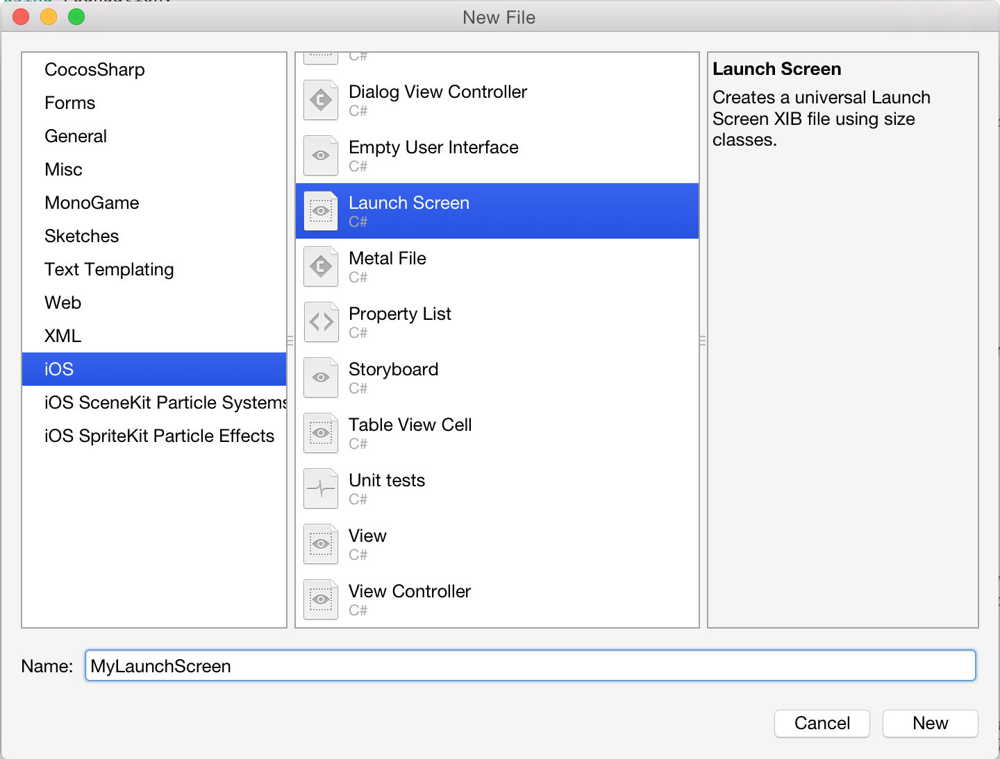
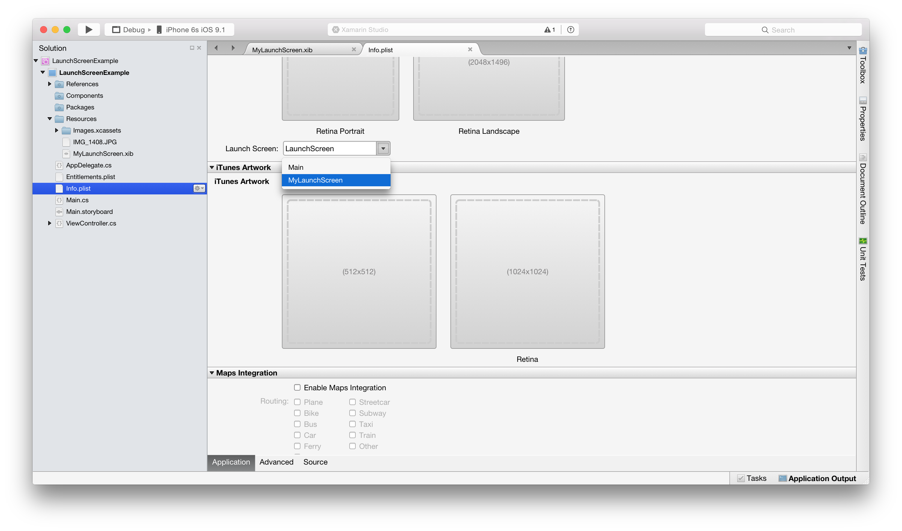

Although Storyboard-based launch screens are most favored by Apple, they can also be created using either a .xib. Regardless of which way you choose, you can now add, design, and create your Launch Screen inside Visual Studio for Mac or Visual Studio using the Xamarin Designer for iOS. For more information on creating a Launch Screen as a Storyboard visit the [Launch Screen](https://developer.xamarin.com/guides/ios/application_fundamentals/working_with_images/launch-screens/#Managing_Launch_Screens_with_Storyboards) guide.

# Recipe

To create a launch screen using a .xib, do the following:

1. Create and iOS single view project.
2. Notice in the Resources folder that there is a **LaunchScreen.xib** file included by default:  
	We can open this .xib to edit it in the Designer, however let's create our own from scratch. Right-Click on **LaunchScreen.xib** to delete it.
3. Right-click on the *Resources* folder and select *Add > New File...*
4. Select *iOS > Launch Screen* and name it **MyLaunchScreen**: 
5. Double-Click to open **MyLaunchScreen.xib** in the iOS Designer.
6. Delete the two labels that are currently in the View.
7. Add a ImageView and a label to the View. You can set the image view to any image that you have added to your application. If you don't have an image, you can use one from the attached project: 
8. Set Constraints on the ImageView and Label. In attached example the constraints are set as follows:
	* Image:
		* Top: top of View
		* Bottom: bottom of View
		* Left: Left of View
		* Right: Right of View
	* Label:
		* Top: Top of Image
		* Bottom: Center of Image
		* Left: Left of Image
		* Right: Right of Image
9. We now need to set this .xib file as our Launch Screen. This is done in the **Info.plist**. Open the Info.plist and under Universal Launch Images, set the Launch Screen dropdown to **MyLaunchScreen**: 
10. Run your app in the simulator. You should see that before it loads your app, it will display your .xib as a Launch Screen: 
	

