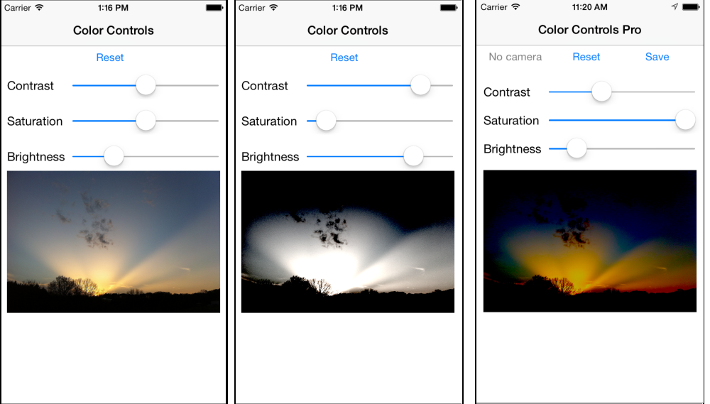

# Recipe

The CoreImage framework provides a number of different
filters that can be applied to images. This recipe shows how to implement the
`CIColorControls` filter with Xamarin.iOS.


 [ ](Images/ColorControls.png)

To implement the `CIColorControls` filter:

-  Make sure your code file references `CoreImage` and `CoreGraphics` namespaces:


```
using CoreImage;
using CoreGraphics;
```

-  Add an image view and load an image (ensure the image has been added to your project with Build Action: BundleResource):


```
imageView = new UIImageView(new CGRect(10, 190, 300, 200));
sourceImage = UIImage.FromFile ("clouds.jpg");
imageView.Image = sourceImage;
View.Add (imageView);
```

-  Add three sliders that will change the value of the brightness, saturation and contrast parameters:


```
sliderBrightness = new UISlider(new CGRect(100,  70, 210, 20));
sliderSaturation = new UISlider(new CGRect(100, 110, 210, 20));
sliderContrast = new UISlider(new CGRect(100, 150, 210, 20));
View.Add (sliderContrast);
View.Add (sliderSaturation);
View.Add (sliderBrightness);
```

-  Set the minimum and maximum values for the sliders based on the `CIColorControls` filter documentation :


```
sliderSaturation.MinValue = 0;
sliderSaturation.MaxValue = 2;
sliderBrightness.MinValue = -1;
sliderBrightness.MaxValue = 1;
sliderContrast.MinValue = 0;
sliderContrast.MaxValue = 4;
```

```
// set default values
sliderSaturation.Value = 1;
sliderBrightness.Value = 0;
sliderContrast.Value = 1;
```

-  Attach a handler to each slider so that the image can be updated when the sliders are changed:


```
sliderContrast.ValueChanged += HandleValueChanged;
sliderSaturation.ValueChanged += HandleValueChanged;
sliderBrightness.ValueChanged += HandleValueChanged;
```

-  Implement the `HandleValueChanged` method to adjust the colors of the image and assign the output to the `UIImageView`:


```
void HandleValueChanged (object sender, EventArgs e)
{
	// use the low-res version
	if (colorCtrls == null)
		colorCtrls = new CIColorControls () { Image = CIImage.FromCGImage (sourceImage.CGImage) };
	else
		colorCtrls.Image = CIImage.FromCGImage(sourceImage.CGImage);
  // re-use context for efficiency
  if (context == null)
		context = CIContext.FromOptions (null);
  // set the values
	colorCtrls.Brightness = sliderBrightness.Value;
	colorCtrls.Saturation = sliderSaturation.Value;
	colorCtrls.Contrast = sliderContrast.Value;
  // do the transformation
	using (var outputImage = colorCtrls.OutputImage) {
		var result = context.CreateCGImage (outputImage, outputImage.Extent);
    // display the result in the UIImageView
		imageView.Image = UIImage.FromImage (result);
	}
}
```

# Additional Information

The transformed image can be saved to the photo album using this code:

```
var someImage = imageView.Image;
someImage.SaveToPhotosAlbum((image, error) => {
    // Called on completion...
    //new UIAlertView("Saved", "Photo saved to Camera Roll", null, "OK", null).Show ();
    Console.WriteLine("CIColorControls image saved to Photos");
});
```

The [Adjust Image Pro](https://github.com/xamarin/Recipes/tree/master/ios/media/coreimage/adjust_contrast_and_brightness_of_an_image/color_controls_pro)
recipe sample includes additional code to take an picture with
the camera, resize it for manipulation then save the original size with the
color changes applied.

